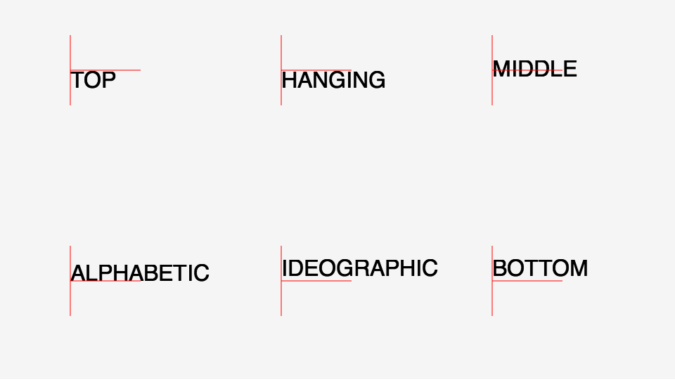
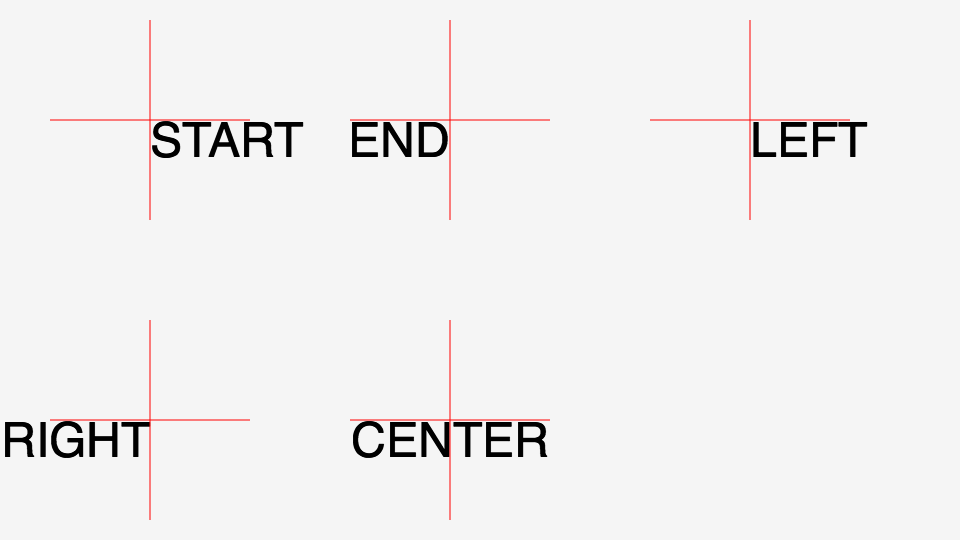

## テキストを表示する

文字を表示するには`createjs.Text`クラスを利用します。

第1引数に、表示したい文字を、第2引数にフォントの種類とサイズを、第3引数に色を指定します。

▼書式
```js
new createjs.Text(テキスト, フォント, 色);
```

▼サンプル(
```js
var t = new createjs.Text("Hello World!", "24px serif", "red");
stage.addChild(t);
```


[サンプルを開く](../samples/3_text.html)


EaselJSのテキストは`textBaseline`プロパティーを使うことで、垂直方向の基準点をどこに合わせるかを指定できます。

▼サンプル
```js
var t = new createjs.Text("Hello World!", "24px serif", "#000000");
t.textBaseline = “top”;
stage.addChild(t);
```



[サンプルを開く](../samples/textBaseline.html)


▲左上から順に、"top", "hanging", "middle",
"alphabetic", "ideographic", "bottom" の結果となります。赤色線は基準点。

テキストの水平方向の揃え方についても`textAlign`プロパティーを使うことで設定ができます。

```js
var t = new Text("Hello World!", "24px serif", "red");
t.textAlign = "center";
stage.addChild(t);
```



[サンプルを開く](../samples/textAlign.html)


▲左上から順に、"start", "end",
"left", "right",
 "center" の結果となります。赤色線は基準点。

テキストの整列については、WHATWGのcanvasの仕様と同じになっていますので、詳しい情報はこちらを参考ください。

http://www.whatwg.org/specs/web-apps/current-work/multipage/the-canvas-element.html#text-0


## フォントの種類

### 明朝体を表示する
```js
var t = new Text("Hello World!", "24px serif", "red");
stage.addChild(t);
```

### ゴシック体を表示する
```js
var t = new Text("Hello World!", "24px sans-serif", "red");
stage.addChild(t);
```

## テキストの文言を変更する

```js
var t = new Text("", "24px sans-serif", "red");
t.text = "test";
stage.addChild(t);
```


## Webフォント
