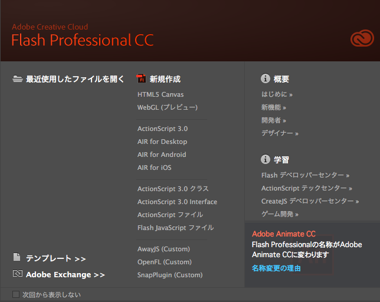
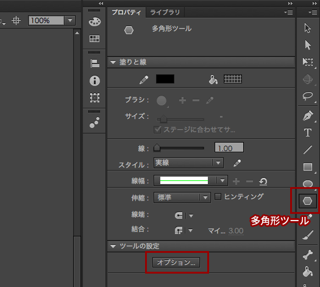
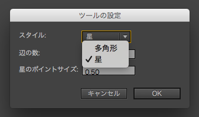
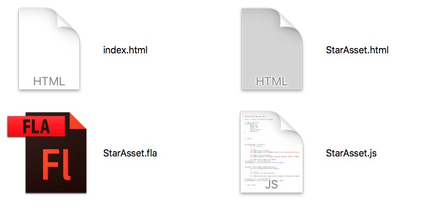
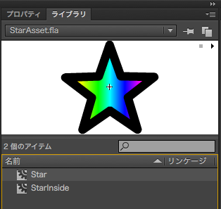

# Adobe Flash Professional CC と CreateJS の連携 (基本編)

<iframe width="560" height="315" src="https://www.youtube.com/embed/RK6Z-ExOwuw" frameborder="0" allowfullscreen></iframe>

Flash Professional CCからHTML5 Canvas素材として書き出し、CreateJSで利用する手順を紹介します。[YouTubeのチュートリアル動画](https://www.youtube.com/watch?v=RK6Z-ExOwuw)を参考に進めましょう。


- [サンプルを再生する](https://ics-creative.github.io/tutorial-createjs/samples/createjs-toolkit/index.html)
- [サンプルのソースコードを確認する](../samples/createjs-toolkit/)


## 1. Adobe Flash Professional CC (Flash Pro CC)を起動

Adobe Flash Professional CCはもともとはFlashやHTML5制作のオーサリングツールです。ステージに直接グラフィックを描いたり、タイムラインを使ってモーションを作ることができます。今回はCreateJS用のグラフィックとモーションを用意したので、起動したら[新規作成]の一覧から[HTML5 Canvas]を選択します。



作成したら作業用フォルダに`StarAsset.fla`ファイルとして保存しましょう。

## 2. シンボルを作成する (ここでは「Star」という名前で作成)

ツールの一覧から多角形ツールを選択します。



[プロパティ]パネルの[オプション]をクリックし、[スタイル]を「星」に設定します。



ステージ上でドラッグ・アンド・ドロップして星を描いてみましょう。

## 3. Flash Pro CCで[プレビュー]するとHTML5素材が出力される

メニューバーから[制御]→[プレビュー]を選択しましょう。するとブラウザが立ち上がり、描いたグラフィックが表示されます。これはHTML5 Canvas (つまりCreateJS)で表示されています。

このとき`StarAsset.fla`ファイルと同階層に2つファイルが作られます。

- `StarAsset.html` : HTML5 Canvasを再生するための再生用のHTMLファイル。
- `StarAsset.js` : Flash Pro CCで作成したデータが保存されているファイル。

## 4. 別ファイルとしてHTMLファイルを作成

制御用のHTMLとして作業用フォルダに`index.html`ファイルを用意しましょう。`StarAsset.fla`ファイルと__同階層に配置ください__。



## 5. CreateJSフレームワークを読み込みましょう

`index.html`ファイルにHTMLコードを書いていきましょう。必要な`body`タグや`canvas`タグは事前に記載しておいてください。

まずはCreateJSフレームワークを`head`タグの中で読み込みましょう。

```js
<!-- CreateJSを読み込む-->
<script src="https://code.createjs.com/createjs-2015.11.26.min.js"></script>
```

※YouTubeのビデオでは、CDNからmovieclipも読み込んでいますが、2015年11月26日から公開された新しいバージョンのCreateJSではmovieclipを別途読み込む必要がなくなりました。


## 6. Flash Pro CCから出力したJSファイルも読み込む

`index.html`ファイルと同じ階層に、`StarAsset.fla`ファイルから出力した`StarAsset.js`ファイルが存在するはずです。このファイルを読み込むため`<script>`タグで取り込みましょう。

```js
<!-- Flash Professional CCのデータを読み込む -->
<script src="StarAsset.js"></script>
```

## 7. CreateJS起動のためのコードを記載する

CreateJSを起動するためのコードを記載しましょう。

```js
window.addEventListener("load", init);
function init(){
  var stage = new createjs.Stage("myCanvas");

  // (省略)
}
```

## 8. Flash Pro CCのシンボルは「lib.Star」という名前で呼び出せる

Flash Pro CCのシンボル名の先頭に「lib.」をつけるとクラスとして利用できます。

```js
// Flash Pro CCのシンボル名の先頭に「lib.」をつけると利用できます
var star = new lib.Star();
```



この「lib.Star」というのはFlash Pro CCの[ライブラリ]パネル内の名前(シンボル名)と一致します。

## 9. 表示オブジェクトとしてStageに追加して制御しよう

```js
star.x = 200;
star.y = 200;
stage.addChild(star);
```

このあとは、`tick`イベント等を登録して`star`インスタンスをマウスに追随させて制御してみましょう。

```js
// 時間経過
createjs.Ticker.addEventListener("tick", onTick);
function onTick(){
  // マウスに追随させる
  star.x = stage.mouseX;
  star.y = stage.mouseY;

  // 画面更新
  stage.update();
}
```

[YouTubeのチュートリアル動画](https://www.youtube.com/watch?v=RK6Z-ExOwuw)ではさらにFlash Pro CCでタイムラインアニメーションを実装する方法を紹介しています。


## 参考

Flash Pro CC内で画像を含めた場合は、初期化の手順が少し複雑になります。

書籍[「Flash for HTML5 ―HTML5開発環境としてのFlash Pro CC活用テクニック」](http://www.amazon.co.jp/dp/B014VWO2BU)の
「外部から更新可能なスライドショーを作ってみよう」(044P)を参照ください。


