**Animate CCはwebアニメーションを制作するソフトウェア**。アドビシステムズというクリエイティブのツールを中心に開発している会社の製品です。このソフトでは、**グラフィックを描きタイムラインで動きをつけ、スクリプトでインタラクティブな操作を実装できます**。これはどういうことかというと、Animate CCを使えば、「動くwebコンテンツ」を自由に作れるということです。

制作できるものの種類は多岐にわたります。アニメやモーショングラフィックスといった動画や映像作品、ゲームやメニュー画面といったインタラクティブコンテンツ、グラフやシミュレーションといったビジュアライゼーション(データの可視化)に利用できます。

初心者でも手軽に使えるうえに、放送品質のアニメまで作り込めるという幅の広さがAnimate CCが最大の魅力です。

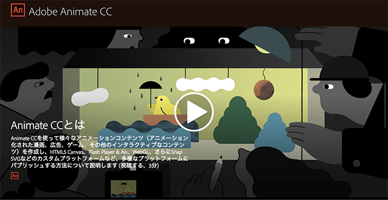

▲ <a href="https://helpx.adobe.com/jp/animate/how-to/make-an-animation.html">公式サイトの紹介ビデオ</a>ではソフトの利用用途や利点がわかりやすく紹介されています

## Animate CCの事例

実際にAdobe Animate CC(旧Flash Professional)は多くの制作現場で使われています。有名な事例をまとめました。

<iframe src="https://player.vimeo.com/video/102103466" width="640" height="360" frameborder="0" webkitallowfullscreen mozallowfullscreen allowfullscreen></iframe>

[Flash animation in Ping Pong on Vimeo](https://vimeo.com/102103466)

▲ TVアニメ「ピンポン」でのアニメーションの動画の様子。「手書きだと動画が大変なので、デジタルで作業しました」とのこと。Flash Professionalのソフト上でアニメが再生されているので、作業がイメージしやすいです。

<iframe width="640" height="360" src="https://www.youtube.com/embed/wItC_fYJ4fI" frameborder="0" allowfullscreen></iframe>

[Long Way North - Official Festival Trailer - YouTube](https://www.youtube.com/watch?v=wItC_fYJ4fI)

▲東京アニメアワード2016の長編アニメ部門グランプリ作品『[Long Way North](http://www.longwaynorththemovie.com/)』。Flashアニメーションとして制作された81分の映画です。予告編は約2分ですが、Animate CCの可能性を知るにはわかりやすい事例です。

<iframe width="640" height="360" src="https://www.youtube.com/embed/tmeU9GFJW3I" frameborder="0" allowfullscreen></iframe>

▲最近だと、2017年公開映画「[夜は短し歩けよ乙女](http://kurokaminootome.com/)」もFlashアニメーションが使われていることで話題に。[IGN Japanのレビュー記事](http://jp.ign.com/yoruhamijikashi/12541/review/)によれば「フラッシュはまるで手描きのアニメーションのような味わいを残す制作ソフトである。国内ではショートアニメーションで使われることが多いが、海外ではテレビなどのより長尺の作品でも一般的に使われる」と紹介されています。

## Adobe Animate CCをはじめるには？

Adobe Animate CCをはじめるには、ソフトの導入が必要になります。Animate CCは有料ソフトですが、AdobeのCreative Cloudという月額課金(もしくは年契約)のサービスを契約して使います。**学生の場合は月1,980円(全CCアプリ利用可)、社会人の場合は月2,180円(単体アプリ)から利用できるので、お手軽です**。昔は10万円近い製品価格だったので、とても導入しやすくなりました。

[HTML5ベクターアニメーションソフト | Animate CC（Flash Pro）](https://www.adobe.com/jp/products/animate.html)

ちなみにはじめは体験版で無料で使うことができます。体験版でも機能制限はないので、購入に慎重な方は様子見で使ってみるのがいいと思います。

## Adobe Animate CCが使えるようになるにはどのくらいかかるのか

1週間から1ヶ月ぐらいでしょう。とは言っても、どのくらいレベルをもって使えると言っていいのか、絵やモーション制作の得手不得手があるので人によりけりです。

多くは大学/専門学校で使いはじめる人が多いですが、**中学生から始める人もいれば、社会人から使いはじめる人もいます。学ぶのに年齢は関係ありません**。学校の放課後の時間や、週末に集中して勉強すれば無理なく覚えていけます。

勉強で使いはじめる人もいれば、趣味で、仕事で、と理由は様々でしょう。「好きこそものの上手なれ」ということわざがありますが、いずれにしても**楽しく学んでいくことが大事**です。

## 新規ファイルを作ろう

Animate CCをインストールしたら起動します。起動したら[新規作成]の一覧から[HTML5 Canvas]を選択します。

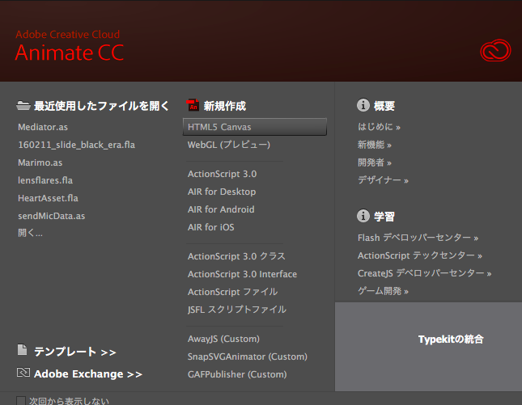

作成したら作業用フォルダに`sample.fla`ファイルとして保存しましょう。ファイル名はwebサイトで公開することを想定して、半角英数字の名前にしましょう。**日本語のファイル名は使わないようにします。**

ここでは簡単な絵を書いて、アニメーションさせるまでを解説します。

## 絵を描こう

画面の右側に[ツール]パネルがあります。このパネルからツールを選んで操作していきます。今回は筆アイコンの[ブラシツール]を使いましょう。

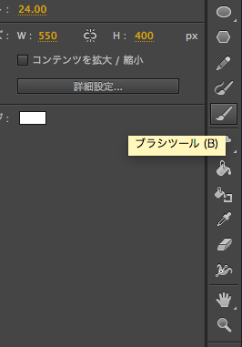

[プロパティー]パネルで色々設定できるので、線の色と太さを設定しておきます。

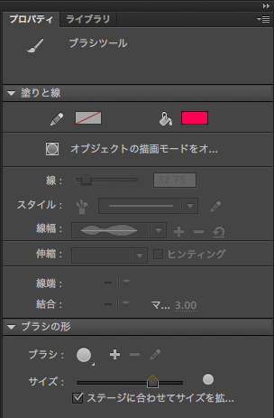

ステージで適当にドラッグして絵を描きます。上手に描けなくても、ここでは使い方をざっくりと覚えることが目的なので気にしないでください。

## シンボルに変換しよう

アニメーションを作る前に絵を「シンボル」というものに変換しなければなりません。シンボルに変換する作業は、動かす対象を設定する作業だと思っておいてください。

描いた絵の全体を、矢印ツールの状態でドラッグ＆ドロップして選択します。選択したら、絵が半透明の表示になります。

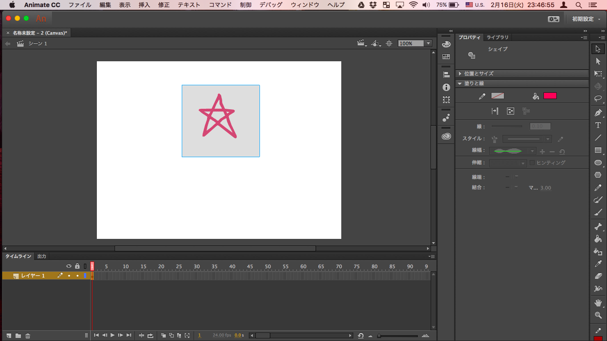

この状態で、メニューバーから[修正]→[シンボルに変換]を選択します。

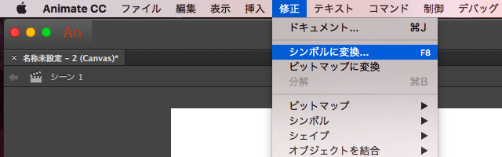

[シンボルに変換]ダイアログでは、[名前]は適当なものを、[種類]は「グラフィック」に設定ください。他にも設定可能な項目がありますが、無視して[OK]をクリックします。

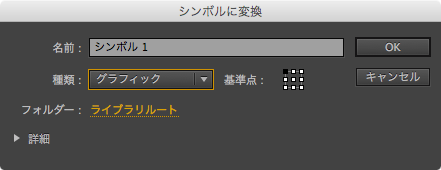

選択したときに、周囲に青い四角が出るようになったらシンボル化完了です。

## 動かそう

さて次はタイムラインの使い方です。マス目のようになっているパネルがタイムラインで、縦がレイヤー順(重ね順)、横が時間を示します。

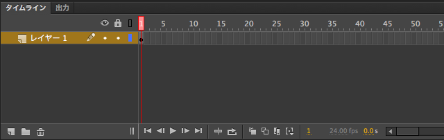

タイムラインには1つの黒い丸があると思います。これをキーフレームと呼びます。キーフレームは「何かがあるフレーム」を指します。

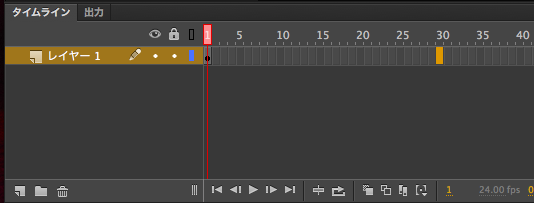

30フレームくらいの適当な場所で右クリックをして、[キーフレームの挿入]を選択します。

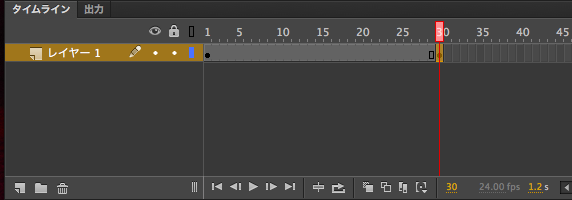

すると灰色のフレームが間に出来るので、その間のどこでもいいのでもう１度右クリックから今度は[クラシックトゥイーンの作成]を選択します。

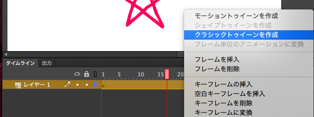

※「トゥイーン」というのは英語の「Between」から派生した用語です。2つのキーフレームの間を補間することが語源となりました。

青くなって矢印がつきます。これで１フレーム目のキーフレームと、30フレーム目のキーフレームがトゥイーンでつながれました。 ためしにちょっと動かしてみましょう。

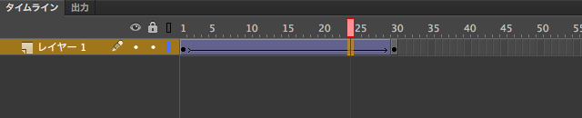

フレームにある赤いマークが現在のフレームをあらわしています。 これをとりあえず３０フレームにあるキーフレームのところまで移動させます。

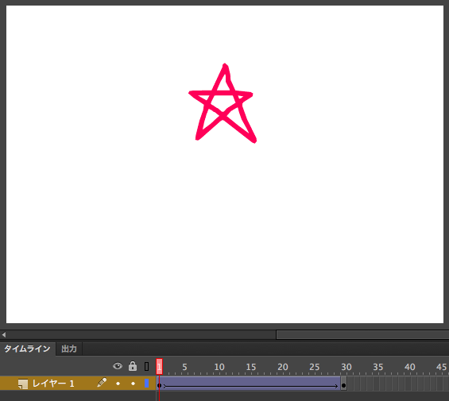

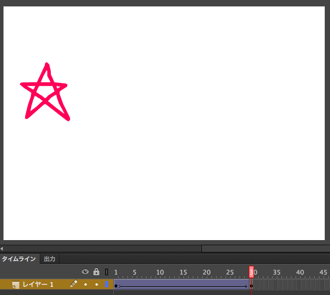

その状態でさっきの絵を適当に移動させます。[Enter]キーを押せばムービーがプレビューします。絵が移動すれば成功です。これが最も単純なアニメーションの基礎となります。

今回の解説は以上となります。

## Animate CCを効率的に学習するには

### お手軽に入門するなら

Animate CCの入門的な学習として、「[初心者のためのAdobe Animateブログ](http://animate.hatenadiary.jp/)」がオススメです。イラスト付きでわかりやすく解説されているので、ここから勉強をはじめてみるといいでしょう。

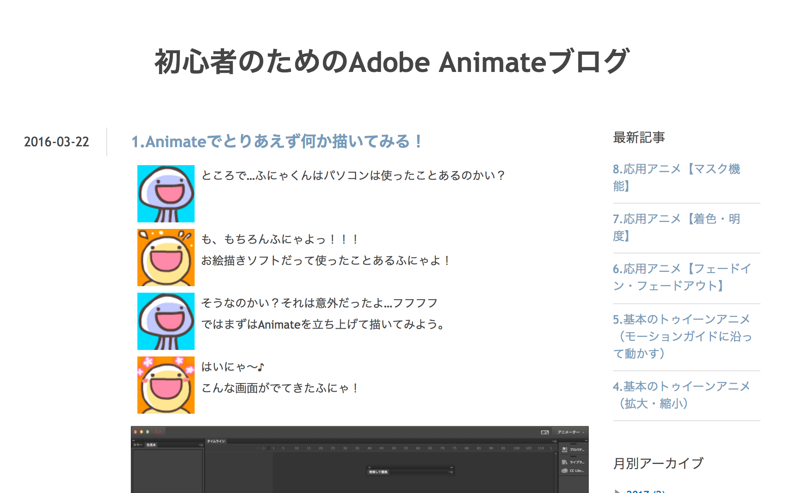

- [1.Animateでとりあえず何か描いてみる！](http://animate.hatenadiary.jp/entry/2016/03/22/182655)
- [2.お絵描き機能の特徴](http://animate.hatenadiary.jp/entry/2016/04/25/150307)
- [3.基本のトゥイーンアニメ（移動アニメ）](http://animate.hatenadiary.jp/entry/2016/05/27/105112)
- [4\.基本のトゥイーンアニメ（拡大・縮小）](http://animate.hatenadiary.jp/entry/2016/07/27/222612)
- [5\.基本のトゥイーンアニメ（モーションガイドに沿って動かす）](http://animate.hatenadiary.jp/entry/2016/09/01/140550)
- [6\.応用アニメ【フェードイン・フェードアウト】](http://animate.hatenadiary.jp/entry/2016/12/23/183144)
- [7\.応用アニメ【着色・明度】](http://animate.hatenadiary.jp/entry/2017/03/01/192850)
- [8\.応用アニメ【マスク機能】](http://animate.hatenadiary.jp/entry/2017/04/20/134018)

### LINEアニメスタンプの制作を通して学ぶには

LINEアニメスタンプの製作にもAnimate CCが役立ちます。Adobe Creative Stationというサイトに、筆者が連載を寄稿しました。特にコマアニメの作り方とトゥイーンアニメの作り方が参考になるでしょう。

- [1. 便利なアニメーション制作機能の紹介](https://blog.adobe.com/jp/publish/2016/10/19/web-animate-cc-animation-stamp-1-overview)
- [2. イラストの制作手順](https://blogs.adobe.com/japan/web-animate-cc-animation-stamp-2-illustration/)
- [3. コマアニメで動きを作る](https://blogs.adobe.com/japan/web-animate-cc-animation-stamp-3-animation/)
- [4. トゥイーンアニメで動きを作る](https://blogs.adobe.com/japan/web-animate-cc-animation-stamp-4-tween)
- [5. APNGファイルの作成](https://blogs.adobe.com/japan/animate-cc-animation-stamp-5-apng)

### 体系的に安心して学ぶには

さらにAnimate CCの使い方を知りたい方は、野中先生の解説講座「[Animate CC 2017 入門](https://www.lynda.jp/courses/learning-animate-cc-2017)」もオススメです。ビデオなので操作につまづくことなく、安心して勉強をすすめられます。有料ですが **書籍の解説書を買うのと同じぐらいの値段でシリーズを勉強できる** ので、最短で覚えることができるはずです。

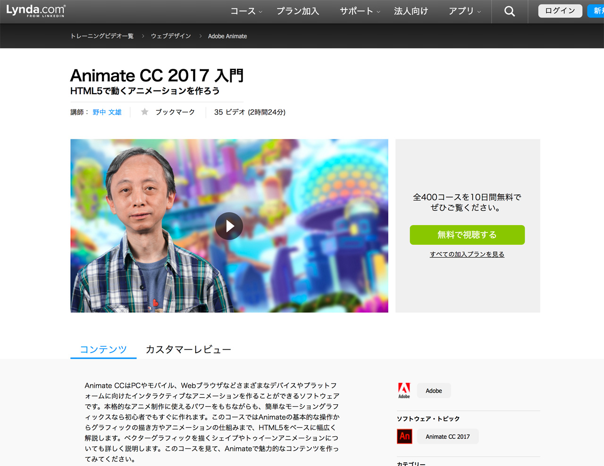

- [Animate CC 2017 入門](https://www.lynda.jp/courses/learning-animate-cc-2017)
