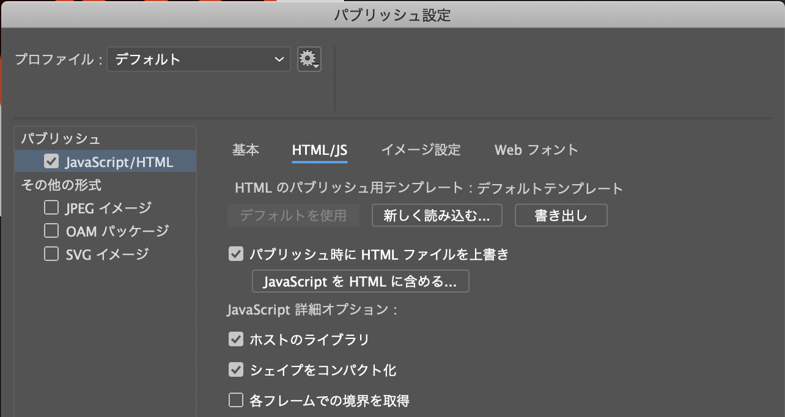

Adobe Animate CCからHTML5 Canvas素材として書き出し、CreateJSで利用する手順の解説、2弾目です。

Adobe Animate CCで画像ファイルを含むコンテンツを作っていた場合に、先の解説と一部手順が異なります。


- [サンプルを再生する](https://ics-creative.github.io/tutorial-createjs/samples/createjs-toolkit-bitmaps/index.html)
- [サンプルのソースコードを確認する](../samples/createjs-toolkit-bitmaps/)


※この記事は、Animate CC 19.1 (CC 2019)での解説内容となります。Animateの以前のバージョンでは動作しない可能性が高いのでご了承ください。

## Adobe Animate CCを起動

今回はCreateJS用のグラフィックとモーションを用意したいので、起動したら[新規作成]の一覧から[HTML5 Canvas]を選択します。


作成したら作業用フォルダに`HeartAsset.fla`ファイルとして保存しましょう。

## 2. シンボルを作成する (ここでは「Star」という名前で作成)

ファイルの読み込みをして、画像を取り込みましょう。


## 3. Animate CCで[プレビュー]するとHTML5素材が出力される

メニューバーから[制御]→[プレビュー]を選択しましょう。するとブラウザが立ち上がり、描いたグラフィックが表示されます。これはHTML5 Canvas (つまりCreateJS)で表示されています。

このとき`HeartAsset.fla`ファイルと同階層にいくつかファイルとフォルダが作られます。

- `HeartAsset.html` : HTML5 Canvasを再生するための再生用のHTMLファイル。
- `HeartAsset.js` : Animate CCで作成したデータが保存されているファイル。
- `images` : 画像が格納されたフォルダ。

## 4. 別ファイルとしてHTMLファイルを作成

制御用のHTMLとして作業用フォルダに`index.html`ファイルを用意しましょう。`HeartAsset.fla`ファイルと__同階層に配置ください__。


## 5. CreateJSフレームワークを読み込みましょう

`index.html`ファイルにHTMLコードを書いていきましょう。必要な`body`タグや`canvas`タグは事前に記載しておいてください。

まずはCreateJSフレームワークを`head`タグの中で読み込みましょう。

```html
<!-- CreateJSを読み込む-->
<script src="https://code.createjs.com/1.0.0/createjs.min.js"></script>
```


## 6. Animate CCから出力したJSファイルも読み込む

`index.html`ファイルと同じ階層に、`HeartAsset.fla`ファイルから出力した`HeartAsset.js`ファイルが存在するはずです。このファイルを読み込むため`<script>`タグで取り込みましょう。

```html
<!-- Adobe Animate CCのデータを読み込む -->
<script src="HeartAsset.js"></script>
```

## 7. CreateJS起動のためのコードを記載する


CreateJSを起動するためのコードを記載しましょう。コードが長くなりますが、モーション中に利用する画像ファイルを先読み（プリロード）する仕組みが入っています。コード中の`★★★`の箇所はFLAファイルごとにIDが異なりますので、パブリッシュしたファイル内からIDを調べて入力ください。


```js
window.addEventListener("load", init);

// コンポジションのIDは出力したJSファイルから調べる必要がある
var comp = AdobeAn.getComposition("★★★");
var lib = comp.getLibrary();

function init() {
  images = window.images || {};

  var loader = new createjs.LoadQueue(false);
  loader.addEventListener("fileload", function(evt) {
    handleFileLoad(evt, comp);
  });
  loader.addEventListener("complete", function(evt) {
    handleComplete(evt, comp);
  });
  loader.loadManifest(lib.properties.manifest);
}

function handleFileLoad(evt, comp) {
  // 読み込んだ画像を保存
  var images = comp.getImages();
  if (evt && evt.item.type == "image") {
    images[evt.item.id] = evt.result;
  }
}

function handleComplete(evt) {
  // スプライトシートに展開
  var ss = comp.getSpriteSheet();
  var queue = evt.target;
  var ssMetadata = lib.ssMetadata;
  for (i = 0; i < ssMetadata.length; i++) {
    ss[ssMetadata[i].name] = new createjs.SpriteSheet({
      images: [queue.getResult(ssMetadata[i].name)],
      frames: ssMetadata[i].frames
    });
  }

  // ここから初期化処理を書く
}
```

## 8. Animate CCのコンテンツを呼び出す

Animate CCのシンボル名の先頭に「lib.」をつけるとクラスとして利用できます。ルートのタイムラインは「`lib.ファイル名`」として呼び出せます。

```js
var root = new lib.HeartAsset();
stage.addChild(root);
```

この「`lib.HeartAsset`」というのはFLAファイル名と一致します。

## 9. 表示オブジェクトとしてStageに追加して制御しよう


このあとは、`tick`イベント等を登録して画面更新をさせましょう。

```js
// 時間経過
createjs.Ticker.addEventListener("tick", onTick);
function onTick(){
  // 画面更新
  stage.update();
}
```


### 代替手段

Animate CCで出力したHTML/JSファイルは構成が複雑なため、データを持ってくるのは大変です。
代替手段としてAnimate CCで出力したHTMLファイルをそのまま使って、JSを書く方が簡単かもしれません。

この場合、flaファイルと同名のHTMLには、次のコードが末尾に記載されています。`fnStartAnimation();`の次の行からJavaScriptを書き始めるといいでしょう。

```js
makeResponsive(false,'both',false,1);	
AdobeAn.compositionLoaded(lib.properties.id);
fnStartAnimation();
```

この方法で処理する場合は、Animate CC側で［パブリッシュ時にHTMLファイルを上書き］のチェックマークを外すことを忘れないようにしましょう。これのチェックボックスが付いていると、パブリッシュする度にHTMLファイルが上書きされてしまうためです。


