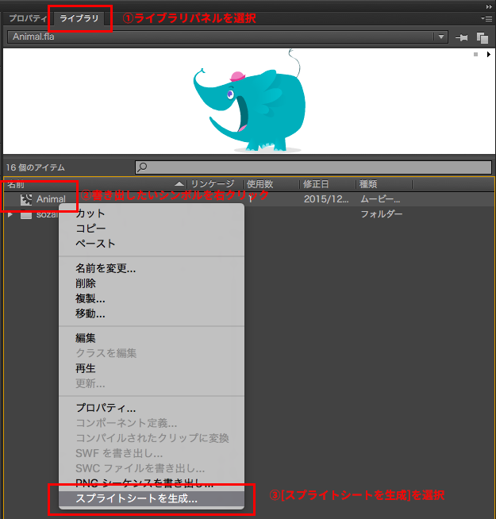
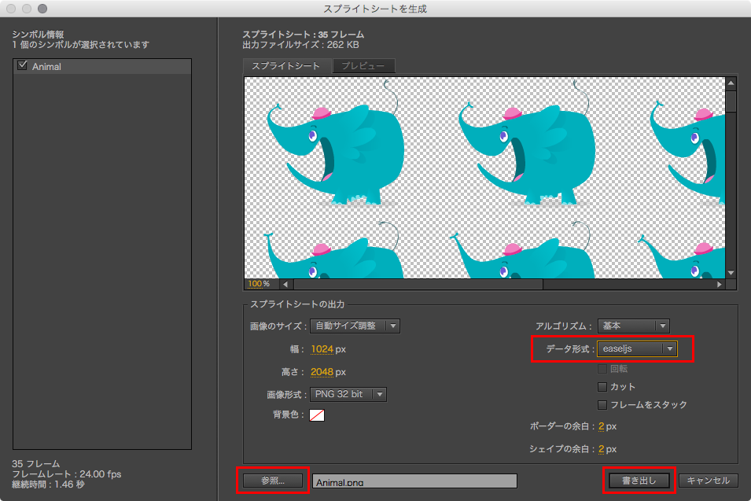
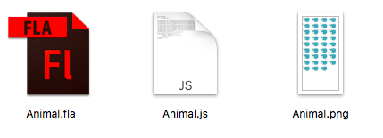
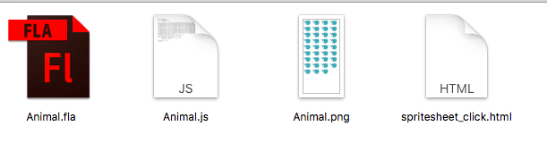

# Adobe Flash Professional CC と CreateJS の連携 (スプライトシート編)

Adobe Flash Professional CCを使ってCreateJS用のスプライトシートを書き出し方を説明します。

※[基本編](adobe_animate_spritesheet.md)とスプライトシート編の違いは、連携のさせ方が異なります。一般的には[基本編](adobe_animate_spritesheet.md)の方法がよく使われます。

まずは FLA ファイルをダウンロードしましょう。

[サンプルのFLAファイルをダウンロードする](../samples/animate_spritesheet/Animal.fla)

※ページ内の[View Raw]リンクをクリックください。

## スプライトシートを書きだそう

FLAファイルを開いたら、[ライブラリ]パネルにある「Animal」シンボルを右クリックし、[スプライトシートを生成]を選択しましょう。



### 書き出し設定

書き出し設定のウインドウでは、次の箇所を設定します。

- [データ形式]を「easeljs」に選択
- [参照]で保存先を設定 (FLAファイルと同階層がいいでしょう)。今回は`Animal.png`ファイルとして保存します。
- その他の設定は任意で構いません

※なお、EaselJSとはCreateJSに含まれるJavaScriptライブラリの一つで、HTML5 Canvasを制御するライブラリです。このサイトの解説で紹介している`createjs.Stage`クラスや`createjs.Shape`クラスは、実はEaselJSライブラリの機能の一つです。



## 出力されたスプライトシートを確認しよう

書き出すと、シンボル名と同名の`js`ファイルと`png`ファイルが出力されます。

- `png`ファイル : スプライトシートの画像です
- `js`ファイル : 余白設定などスプライトシートの付与情報が記載されています。このファイルを読み込むことで、CreateJSで簡単にスプライトシートを利用することができます。



## スプライトシートをCreateJSで使おう

次に、制御用のHTMLファイルとして、`spritesheet_click.html`を作成しましょう。



`spritesheet_click.html`ファイルでは、CreateJSライブラリと、FLAから書き出したJSファイルを読み込みます。

```html

<script src="https://code.createjs.com/createjs-2015.11.26.min.js"></script>
<script src="Animal.js"></script>
```

CreateJSのステージにスプライトシートを配置してみましょう。`Animal.js`ファイルを読み込むとスプライトシートを扱うためのクラスが自動的に定義されます。FLAファイルでは「Animal」というシンボルで作っていたので、`Animal.js`ファイルを読み込むことによって、JavaScriptの「Animal」というクラスが定義されました。

`new シンボル名()`とコードを書くと、表示オブジェクトのインスタンスを作ることができます。`addChild()`メソッドを使って画面に表示し、`play()`メソッドを使ってスプライトシートを再生します。

```js
// スプライトを作成
var chara = new Animal();
stage.addChild(chara);

// スプライトを再生する
chara.play();
```

## 実行結果

次のサンプルを再生して試してみましょう。動物をクリックすると再生したり停止したりします。

- [サンプルを再生する](https://ics-creative.github.io/tutorial-createjs/samples/animate_spritesheet/spritesheet_click.html)
- [サンプルのソースコードを確認する](../samples/animate_spritesheet/spritesheet_click.html)


<article-author>[池田 泰延](https://twitter.com/clockmaker)</article-author>
<article-date-published>2015-12-18</article-date-published>
<article-date-modified>2016-02-12</article-date-modified>
