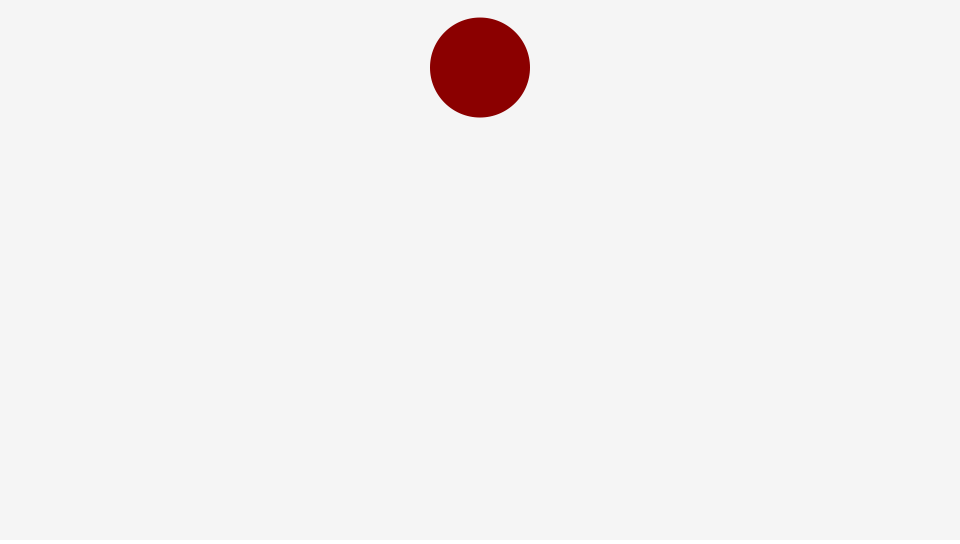

# CreateJSで物理演算〜落下するボールの作成〜



- [サンプルを再生する](https://ics-creative.github.io/tutorial-createjs/samples/ball.html)
- [サンプルのソースコードを確認する](../samples/ball.html)


## ボールの作成

シェイプの作成

```js
//　ボールを作成
var ball = new createjs.Shape();
ball.graphics.beginFill("DarkRed").drawCircle(0, 0, radius);
ball.x = stage.canvas.width / 2; // 画面中央から
stage.addChild(ball);
```

## 重力計算
```js
// 速度情報
var vy = 0;

// 時間制御
createjs.Ticker.addEventListener("tick", handleTick);
function handleTick() {
    // 重力計算
    vy += 1;

    // 時間制御
    ball.y += vy;
}
```

## 壁の作成 & 衝突判定

```js
createjs.Ticker.addEventListener("tick", handleTick);
function handleTick() {
    // 重力計算
    vy += 1;

    // 時間制御
    ball.y += vy;

    if (ball.y + radius > stage.canvas.height) {
        ball.y = stage.canvas.height - radius;
        vy *= -0.7 ;
    }
}
```


天井とぶつかるときのコード

```js
if (ball.y + radius > stage.canvas.height) {
    ball.y = stage.canvas.height - radius;
    vy *= -0.7;
} else if (ball.y - radius < 0) {
    ball.y = radius;
    vy *= -0.7;
}
```

水平方向の壁の作成

```js
// 時間制御
ball.x += vx;

// 画面の端からはみ出さないようにする処理
if (ball.x + radius > stage.canvas.width) {
    ball.x = stage.canvas.width - radius;
    vx *= -0.7;
} else if (ball.x - radius < 0) {
    ball.x = radius;
    vx *= -0.7;
}
```

## 摩擦の作成

```js
// 摩擦
vx *= 0.98;
vy *= 0.98;
```


## ドラッグ処理を実装するコード

ドラッグ処理は[mouse_drag.md](mouse_drag.md)を参考にしてください。

ドラッグ中には重力計算は行わないようにするための条件文を追加します。
```js
// 時間制御
createjs.Ticker.addEventListener("tick", handleTick);
function handleTick() {
  // ドラッグ中でないときだけ計算を行う  
  if(dragFlag == false) {
      // 重力計算
      vy += 1;

・・・（いろいろな処理）・・・
      // 左側の壁
      if(ball.x < ballsize){
        vx *= -0.8;
        ball.x = ballsize;
      }
    }
}
```


```js
var vx = 0; // 初期の速さ
var vy = 0;
var oldX;
var oldY;
var flag = false;
var radius = 50;

//　ボールを作成
var ball = new createjs.Shape();
ball.graphics.beginFill("DarkRed").drawCircle(0, 0, radius);
ball.x = stage.canvas.width / 2; // 画面中央から
stage.addChild(ball);

// インタラクティブの設定
ball.addEventListener("mousedown", handleDown);
ball.addEventListener("pressmove", handleMove);
ball.addEventListener("pressup", handleUp);

// ボールを押したときの処理です
function handleDown(event) {
    // マウスの位置を保存
    oldX = stage.mouseX;
    oldY = stage.mouseY;

    // ボールの速度を無効にする
    flag = true;
}

function handleMove(event) {
    ball.x = stage.mouseX;
    ball.y = stage.mouseY;
}

// ボールからマウスを離したときの処理です
function handleUp(event) {
    // ボールの速度を有効にする(ドラッグした距離に応じて、速度を設定)
    vx = stage.mouseX - oldX;
    vy = stage.mouseY - oldY;

    // ボールの速度を無効にする
    flag = false;
}
```
