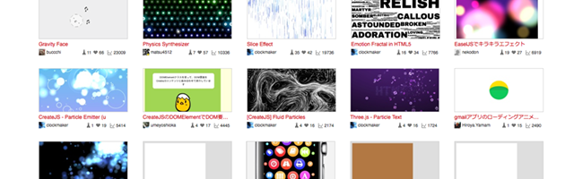

CreateJSが使って作られたウェブサイトや実験サイトをまとめました。CreateJS を使うことでどのような表現が可能なのか、事例を通して可能性を探っていきましょう。

## CreateJS の事例

[gskinner lab](https://lab.gskinner.com)

CreateJSを開発しているgskinner社の実験サイト。ビジュアル・アートのデモが多数公開されています。それぞれのデモは完成形に至るまでの開発バージョンを掲載しており、完成品にたどり着くまでどのような開発の過程があったかを確認できます。

[Planetary Gary](http://sandbox.createjs.com/PlanetaryGary/)

シンプルなシューティングアクションゲーム。[ソースコード](https://github.com/CreateJS/sandbox/tree/master/PlanetaryGary)も公開されており、CreateJSの学習に適した教材にもなっています。

[日本全国花粉飛散マップ](https://ics-web.jp/projects/pollenmap/)

花粉の飛散量をデータビジュアライゼーションしたスペシャルサイト。CreateJSの得意とするラインの描画やパーティクルの演出を駆使したリッチ表現のサイトとなっています。

[jsdo.it](http://jsdo.it/tag/createjs?search_order=favorite)

ユーザーがコードを投稿できるウェブサービス。CreateJSのコードが多数投稿されています。他のユーザーが開発したコードを眺めて、インスピレーションを得たり参考にするのがいいでしょう。

[次の記事へ](quickstart.md)
