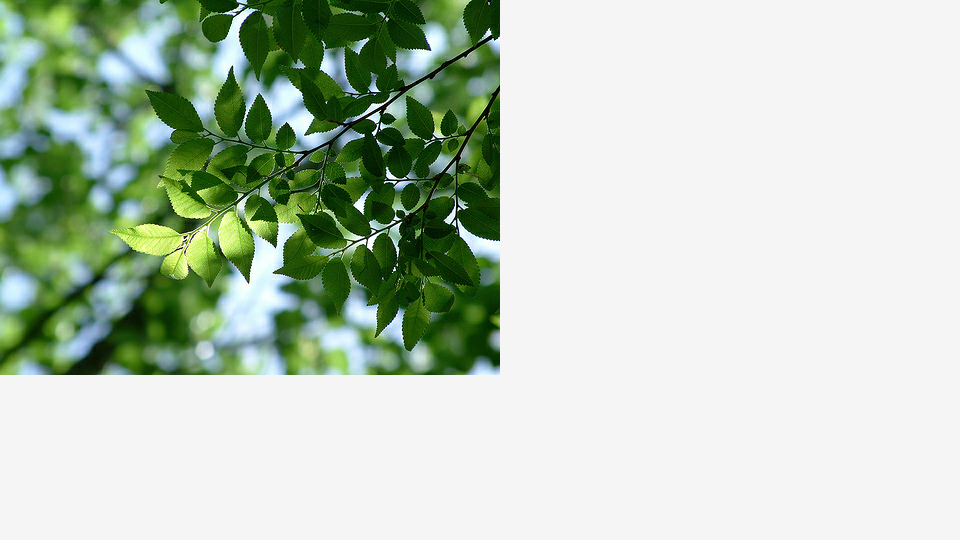

CreateJSでは、画像ファイル形式のPNG画像/JPEG画像/GIF画像/SVG画像を画面に表示することができます。Adobe PhotoshopやIllustratorなどのソフトウェアでグラフィックや写真・イラストを作成することで、表現の幅が広がるでしょう。それらのソフトウェアで汎用フォーマットのPNG形式もしくはJPEG形式で保存しておきます。

CreateJSで画像を表示するには`createjs.Bitmap`クラスを利用します。コンストラクターの引数には画像のURLを設定します。

書式

```js
new createjs.Bitmap(画像のURL);
```

サンプル

```js
var bmp = new createjs.Bitmap("sample.png");
stage.addChild(bmp);
```



- [サンプルを再生する](https://ics-creative.github.io/tutorial-createjs/samples/bitmap.html)
- [サンプルのソースコードを確認する](../samples/bitmap.html)

※このサンプルでは、`createjs.Ticker`クラスを利用していますが、このクラスの使い方は後述します。

※`createjs.Bitmap`クラスの詳しい使い方は「[公式ドキュメント(英語)](https://createjs.com/docs/easeljs/classes/Bitmap.html)」を確認ください。

## 基準点の設定方法

画像の基準点を調整したい場合は、`regX`と`regY`プロパティーを使うと便利です。標準では左上を基準点となりますが、これらのパロパティーで基準点を調整すれば角度回転やスケール変更のときに役立ちます。

```js
var bmp = new createjs.Bitmap("sample.png");
stage.addChild(bmp);

// 基準点を調整する
bmp.regX = 100;
bmp.regY = 100;
```

次のサンプルでは左側は画像の基準点はデフォルトのままで左上になっているため、`rotation`プロパティーによる回転アニメーションでは変な位置を中心に回転します。対して右側は`regX`と`regY`プロパティーを調整して画像の中央にしているため、回転アニメーションは画像中心が基準となっています。


- [サンプルを再生する](https://ics-creative.github.io/tutorial-createjs/samples/bitmap_reg.html)
- [サンプルのソースコードを確認する](../samples/bitmap_reg.html)


※`regX`プロパティーの詳しい使い方は「[公式ドキュメント(英語)](https://createjs.com/docs/easeljs/classes/Bitmap.html#property_regX)」を確認ください。


## 画像の制限

ローカル上ではHTML5 Canvasのセキュリティーの制限があるため、Google Chromeでは期待どおりに挙動しない場合があります(例：`createjs.Bitmap`オブジェクトをクリックしたらエラーが発生する等)。その時は、Firefoxで確認してみましょう。

webサーバーにアップすれば、その問題は解消され、Google Chromeでも問題なく挙動するようになります。

[次の記事へ](nest.md)

