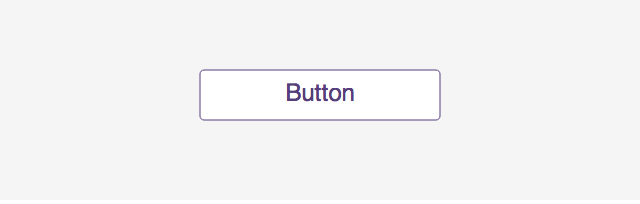

CreateJSでボタンを作成する方法を説明します。ただし、「ボタン」といってもCreateJSにボタンを作成するズバリな機能があるわけではありません。なぜならば、CreateJSではどんなシェイプであってもビットマップであっても何でもボタンにすることができるためです。[CreateJS のクリック処理の実装方法](mouse_click.md)で説明したとおり、クリックイベントさえ仕込めばなんであってもボタンとして挙動させることができます。

ここでは一般的なボタンとして振る舞えそうなデザインのボタンの作成方法を、基本から解説していきます。

## シンプルなボタンの基本構成

まずはシンプルなボタン構成を考えてみましょう。クリックするとアラートが表示されるだけのシンプルなボタンサンプルです。



- [サンプルを再生する](https://ics-creative.github.io/tutorial-createjs/samples/button_simple.html)
- [サンプルのソースコードを確認する](../samples/button_simple.html)


ボタンらしく見せるためにはクリッカブルな範囲を示す座布団と、クリック時に起こるアクションを示したラベルの2つの要素が必要です。2つの要素を含めることになるので、`createjs.Container`クラスを利用してグループ化して作成します。

```js
// ボタン要素をグループ化
var button = new createjs.Container();
stage.addChild(button);

// 座布団を作成
var bg = new createjs.Shape();
// 座布団のグラフィックを描く (省略)
button.addChild(bg);

// ラベルを作成
var label = new createjs.Text("Button", "24px sans-serif", "#563d7c");
// ラベルの配置場所を調整 (省略)
button.addChild(label);
```

ここで作成したボタンにクリック時のイベントを仕込みたいので、`addEventListener()`メソッドを使って`click`イベントを登録します。

```js
// イベントを登録
button.addEventListener("click", handleClick);
function handleClick(event) {
  // クリックされた時の処理を記述
  alert("クリックされました。");
}
```


## ロールオーバーを利用する

より実用的なボタンを作成してみましょう。ボタンにマウスカーソルが触れたとき、グラフィックが変化する「ロールオーバー」を実装するとボタンらしくなります。ロールオーバーによって、エンドユーザーはそれがボタンとして挙動することを認識します。ここでは[CreateJS のマウスオーバー/マウスアウトの実装方法](mouse_over.md)で紹介した方法を使ってロールオーバー(ホバー)を実装してみます。


- [サンプルを再生する](https://ics-creative.github.io/tutorial-createjs/samples/button_rollover.html)
- [サンプルのソースコードを確認する](../samples/button_rollover.html)

まずはステージのロールオーバーを有効にします。

```js
// マウスオーバーを有効にする
stage.enableMouseOver();
```

一般的にエンドユーザーはグラフィックをボタンとして認識するために、マウスカーソルの形状を無意識のうちに意識しています。ボタンにロールオーバーにしたときにマウスカーソルの形状を変更するように指定します。`cursor`プロパティーを`pointer`に設定すれば、通常はマウスカーソルは矢印マークですが、ボタンに触れたときに指マークに変化します。

```js
// ボタン要素をグループ化
var button = new createjs.Container();
button.cursor = "pointer"; // ホバー時にカーソルを変更する
stage.addChild(button);
```

ロールオーバー時にグラフィックを変更するために、今回は通常時とロールオーバー時の2種類の座布団を用意します。`visible`プロパティーを使って、初期表示時はロールオーバー用の座布団は非表示にしておきます。

```js
// 通常時の座布団を作成
var bgUp = new createjs.Shape();
// グラフィックを作成
button.addChild(bgUp);
bgUp.visible = true; // 表示する

// ロールオーバー時の座布団を作成
var bgOver = new createjs.Shape();
// グラフィックを作成
bgOver.visible = false; // 非表示にする
button.addChild(bgOver);

// ラベルを作成
var label = new createjs.Text("Button", "24px sans-serif", keyColor);
// 配置場所を調整
button.addChild(label);
```

ロールオーバーの処理で二種類の座布団のうち、通常用の座布団を非表示にし、ロールオーバー用の座布団を表示します。ロールアウト時にはその逆の処理を実装します。

```js
// ロールオーバーイベントを登録
button.addEventListener("mouseover", handleMouseOver);
button.addEventListener("mouseout", handleMouseOut);
function handleMouseOver(event) {
  bgUp.visble = false;
  bgOver.visible = true;
  label.color = "white";
}
function handleMouseOut(event) {
  bgUp.visble = true;
  bgOver.visible = false;
  label.color = "parple";
}
```

二種類の座布団の表示・非表示を切り替えることで実現しています。他にもいろいろと実装方法はあるので一例として参考ください。


## ボタンを作成するコードを汎用化

ここまで紹介したコードですが、ボタンを作成するだけでも長いコードを書かなければならず面倒に思った方も多いでしょう。JavaScriptの関数にボタンを作成するためのコードをまとめておくと、使い回しがしやすく便利になります。次のサンプルでは3つのボタンを画面に配置していますが、それらは関数を使って作成しています。


- [サンプルを再生する](https://ics-creative.github.io/tutorial-createjs/samples/button_create_like_bootstrap.html)
- [サンプルのソースコードを確認する](../samples/button_create_like_bootstrap.html)


関数では`return`キーワードによって、作成したボタンを戻り値としておきます。

```js
/**
* CreateJSのボタンを作成する関数です。
* この関数でボタンを作ったらステージに追加したり、クリックイベントを登録しましょう。
* @param {String} text ボタンのラベル文言です。
* @param {Number} width ボタンの横幅(単位はpx)です。
* @param {Number} height ボタンの高さ(単位はpx)です。
* @param {String} keyColor ボタンのキーカラーです。
* @returns {createjs.Container} ボタンの参照を返します。
*/
function createButton(text, width, height, keyColor) {
  // ボタン要素をグループ化
  var button = new createjs.Container();
  // ボタンの実装処理・・・(省略)
  return button;
}
```

この関数`createButton()`を実行すればボタンを作成できるので、配置したい場所に座標を調整したり、`addChild()`メソッドでステージに配置します。必要に応じてクリックイベントも登録するといいでしょう。

```js
// ボタンを作成
var btn1 = createButton("Click Blue!", 150, 40, "#0275d8");
btn1.x = 50;
btn1.y = 80;
stage.addChild(btn1);

// イベントを登録
btn1.addEventListener("click", handleClick);
function handleClick(event) {
  // クリックされた時の処理を記述
  alert(event.currentTarget + " がクリックされました。");
}
```

コードの見通しがよくなったように思いませんか？

こうやって作っておくとコピペ(コピー&ペースト)でボタンが作れます。

また[Adobe Animate CC](adobe_animate.md)を使えば、さらに自由度が高くボタンのグラフィックを作成できます。直感的に作成できるので活用してみるといいでしょう。

