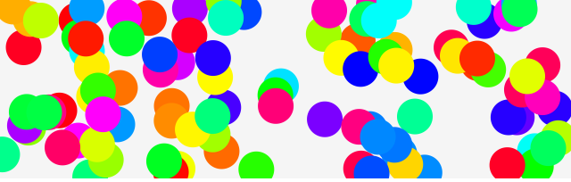
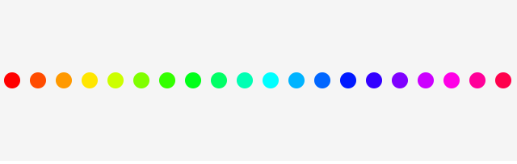
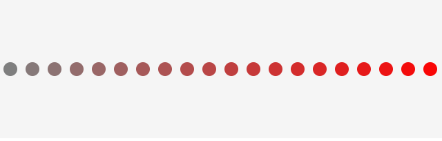
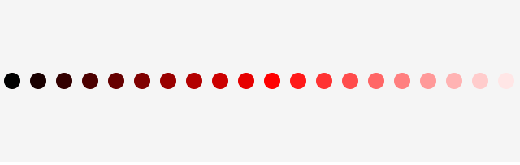
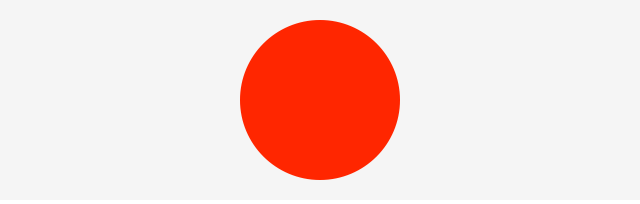
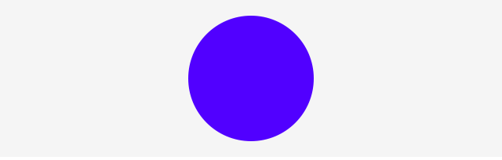

# CreateJS で HSL カラーを使いこなそう

[カラー](color.md)の項目で説明したHSLカラー。HSLカラーは色のモーションを作る上でとても便利な色彩設定方法です。何の色であるかは色相、鮮やかであるか色あせているかは彩度、明るか暗いかは明度、というパラメーターで人間にとっても直感的です。

色相(Hue)と彩度(Satuation)と明度(Luminance)という3つのパラメーターはそれぞれは数値で指定します。数値であればプログラムによって制御ができます。つまり、人間に直感的なパラメーターをプログラムで扱うことができるのです。

それでは、色の設定方法を幾つかのサンプルを通して学習していきましょう。

## ランダムな色の円を配置する

ランダムな色の円を大量に配置してみましょう。



- [サンプルを再生する](https://ics-creative.github.io/tutorial-createjs/samples/color_hsl_dots.html)
- [サンプルのソースコードを確認する](../samples/color_hsl_dots.html)

HSLカラーの一つ目のパラメーターである色相は、0〜360度で全ての色相環を示します。同じ明るさで同じ鮮やかさのバリエーションのある色を得たければ、色相だけをランダムにすればいいのです。

ランダムなといえばJavaScriptでは定番の`Math.random()`関数を利用しましょう。色相で0〜360度のうちランダムな値を得られればいいので、`Math.random()`関数に`360`を掛け算します。変数`color`にはランダムに設定された色の情報(文字列)が保存されます。

```js
// HSLカラーを算出
var hue = 360 * Math.random();
var color = "hsl(" + hue + ", 100%, 50%)";
```

ランダムで作っているということをわかりやすくするために、`for`文によって100個の円を配置します。100個の円はそれぞれランダムに設定された色となります。

```js
for (var i = 0; i < 100; i++) {
  // シェイプを作成
  var shape = new createjs.Shape();
  stage.addChild(shape);

  // HSLカラーを算出
  var hue = 360 * Math.random();
  var color = "hsl(" + hue + ", 100%, 50%)";

  var x = stage.canvas.width * Math.random();
  var y = stage.canvas.height * Math.random();

  shape.graphics.clear()
          .beginFill(color)
          .drawCircle(x, y, 20);
}
```

## 色相と彩度と明度を順番に配置する

### 色相

色相をずらしながら、左側から右側へ順番に円を配置してみましょう。左端が`0`、中央が`180`、右端が`360`となります。



- [サンプルを再生する](https://ics-creative.github.io/tutorial-createjs/samples/color_hsl_dots_hue.html)
- [サンプルのソースコードを確認する](../samples/color_hsl_dots_hue.html)


```js
var MAX = 20;
for (var i = 0; i < MAX; i++) {
  // HSLカラーを算出
  var hue = i * (360 / MAX);
  var color = "hsl(" + hue + ", 100%, 50%)";
  // (省略)
}
```

### 彩度

彩度をずらしながら、左側から右側へ順番に円を配置してみましょう。左端が`0`%、中央が`50`%、右端が`100`%となります。左端が灰色で、右側に行くほど色が鮮やかになっていきます。



- [サンプルを再生する](https://ics-creative.github.io/tutorial-createjs/samples/color_hsl_dots_satuation.html)
- [サンプルのソースコードを確認する](../samples/color_hsl_dots_satuation.html)

```js
var MAX = 20;
for (var i = 0; i < MAX; i++) {
  // HSLカラーを算出
  var saturation = i * (100 / MAX);
  var color = "hsl(0, " + saturation + "%, 50%)";
  // (省略)
}
```

### 明度

明度をずらしながら、左側から右側へ順番に円を配置してみましょう。左端が`0`%、中央が`50`%、右端が`100`%となります。左端が暗く、右側に行くほど明るくなっていきます。



- [サンプルを再生する](https://ics-creative.github.io/tutorial-createjs/samples/color_hsl_dots_luminance.html)
- [サンプルのソースコードを確認する](../samples/color_hsl_dots_luminance.html)


```js
var MAX = 20;
for (var i = 0; i < MAX; i++) {
  // HSLカラーを算出
  var luminance = i * (100 / MAX);
  var color = "hsl(0, 100%, " + luminance + "%)";
  // (省略)
}
```


## グラフィックの色を時間経過で変化させる

時間経過で色が変わっていく表現を作ってみましょう。



- [サンプルを再生する](https://ics-creative.github.io/tutorial-createjs/samples/color_hsl_motion.html)
- [サンプルのソースコードを確認する](../samples/color_hsl_motion.html)

色相の数値を`tick`イベントでインクリメントしていけば、色相は時間経過で変わっていくことになります。はじめは0度(赤色)から始まり、`+1.0`ずつ数字が大きくなります。いずれ120度(緑色)、240度(青色)、そしていずれ360度(この時は赤色)に達します。

```js
// 色相
var hue = 0;

// 時間経過
createjs.Ticker.addEventListener("tick", handleTick);
function handleTick() {
  // HSLカラーを算出
  var color = "hsl(" + hue + ", 100%, 50%)";

  shape.graphics.clear()
          .beginFill(color)
          .drawCircle(320, 100, 80);

  // 色相を変化
  hue += 1.0;

  stage.update(); // 画面更新
}
```

色相が360度を超えた場合、色相は0度と同じ赤色を示します。2周しても3周しても、360度で割った余りの数値と同じカラーが得られます。色相環と呼ばれるとおり、何周しても同じ場所を指し示します。

## 範囲を定めて色を時間経過で変化させる

特定の色相範囲内だけでモーションをさせてければ、三角関数を利用するといいでしょう。[三角関数のモーション](math_trigonometry.md)で解説したテクニックをHSLカラーの設定にも使ってみましょう。



- [サンプルを再生する](https://ics-creative.github.io/tutorial-createjs/samples/color_hsl_sin.html)
- [サンプルのソースコードを確認する](../samples/color_hsl_sin.html)

このサンプルでは180度の色相(シアン=水色)を中心に、プラスマイナス80度の範囲で色が変化します。

```js
var angle = 0;
var centerHue = 180;
var radius = 80;
var speed = 0.01;

// 時間経過
createjs.Ticker.addEventListener("tick", handleTick);
function handleTick() {
  // HSLカラーを算出
  var hue = centerHue + Math.cos(angle) * radius;
  var color = "hsl(" + hue + ", 100%, 50%)";

  shape.graphics.clear()
          .beginFill(color)
          .drawCircle(320, 100, 80);

  angle += speed;

  stage.update(); // 画面更新
}
```


<article-author>[池田 泰延](https://twitter.com/clockmaker)</article-author>
<article-date-published>2015-12-21</article-date-published>
<article-date-modified>2016-01-17</article-date-modified>
