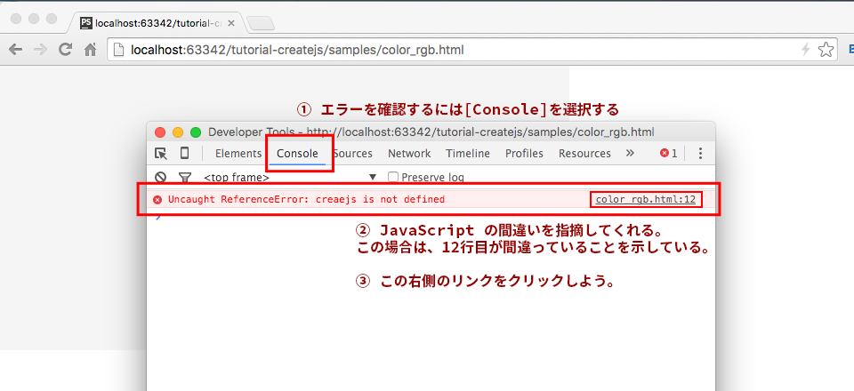
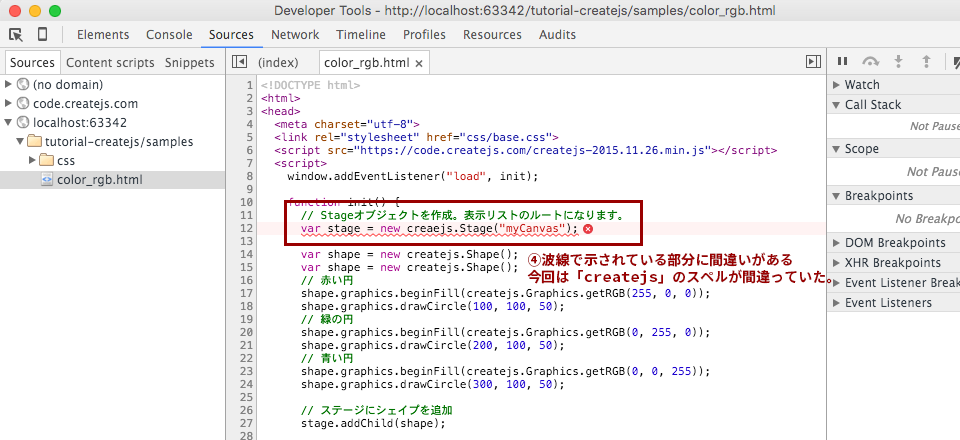

# 制作の前にブラウザの開発ツールの使い方を抑えよう

## Google Chrome の開発ツール

本格的に CreateJS を学ぶ前に、Google Chrome の開発ツールの使い方を覚えましょう。JavaScriptをプログラミングしていくと、スペル間違いや文法間違い、コードの間違いなど様々なミスが発生します。開発ツールを使えば、コードのどの部分が間違っているのかヒントを得ることができます。

### コンソール(Console)を使うことのメリット

- JavaScriptのエラー箇所がわかる
- 実行ログが確認できるようになり、プログラム動作の理解に役立つ

### 使い方

Google Chromeメニュー(右上の横棒三個のアイコン)をクリック

1. ［その他のツール］→［デベロッパーツール］を選択
2. デベロッパーツールと呼ばれる機能が表示される
3. タブの［Console］を選択
4. JavaScriptのエラーがあるときに、［Console］パネルに指摘が表示される

