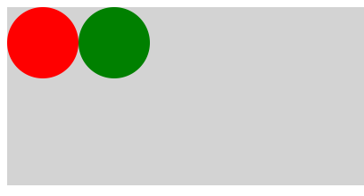

自身の表示リストから、「任意の表示オブジェクト」を除外するには、`removeChild()` メソッドを使用します。



- [サンプルを再生する](https://ics-creative.github.io/tutorial-createjs/samples/displayobject_remove.html)
- [サンプルのソースコードを確認する](../samples/displayobject_remove.html)


次の例では、`container` という名前の表示オブジェクトコンテナを作成し、次に 2 つの子表示オブジェクトをコンテナにー追加します。コンテナーの子オブジェクトをクリックしたときに、`removeChild()` メソッドが、クリックされた子をコンテナの子リストから削除します。

```js
// ステージを作成
var stage = new createjs.Stage("myCanvas");

// コンテナー(容れ物)を作成
var container = new createjs.Container();
stage.addChild(container);

// 赤い円を作成
var circleRed = new createjs.Shape();
circleRed.graphics.beginFill("DarkRed").drawCircle(40, 40, 40);

// 緑の円を作成
var circleGreen = new createjs.Shape();
circleGreen.graphics.beginFill("green").drawCircle(120, 40, 40);

// ２つの円をコンテナーに追加
container.addChild(circleRed);
container.addChild(circleGreen);

// 各種マウスイベントを登録する
circleRed.addEventListener("click", handleRedClick);
circleGreen.addEventListener("click", handleGreenClick);

// クリックしたとき
function handleRedClick(event) {
  // 赤の円をコンテナーから削除
  container.removeChild(circleRed);
}

function handleGreenClick(event) {
  // 緑の円をコンテナーから削除
  container.removeChild(circleGreen);
}
```

[次の記事へ](ticker.md)
