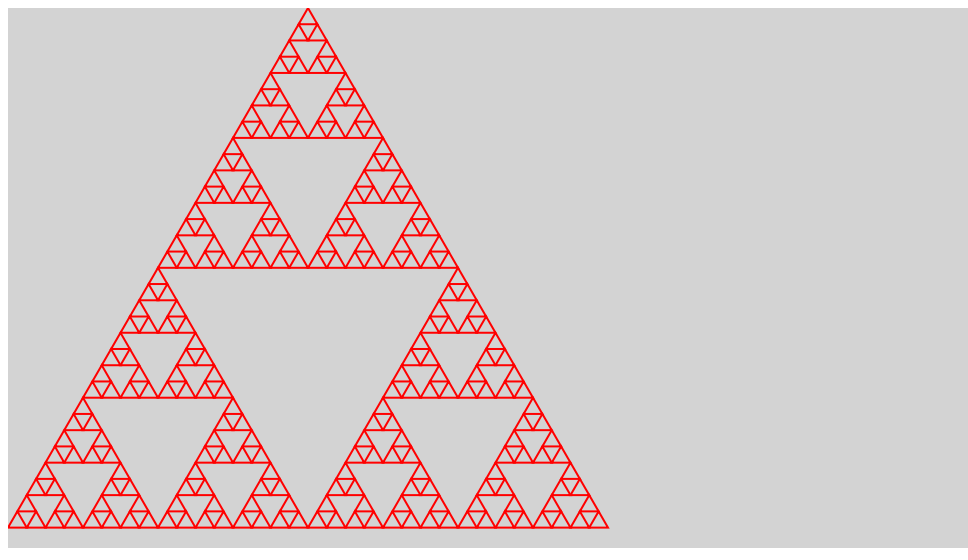
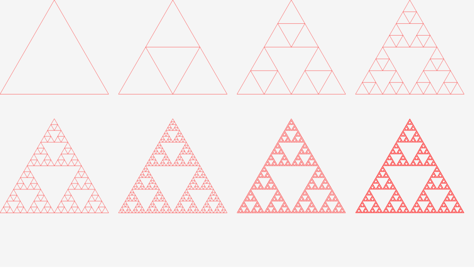
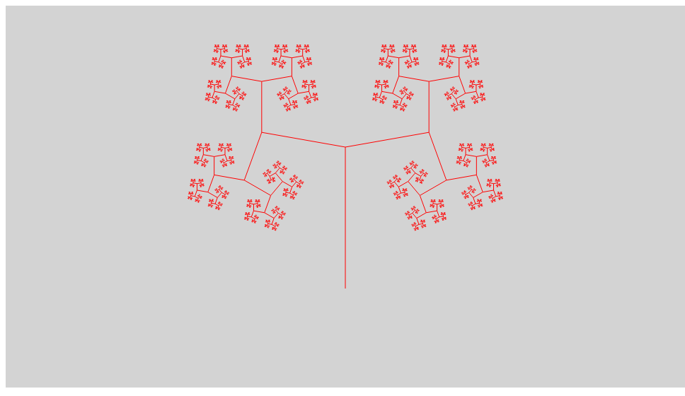
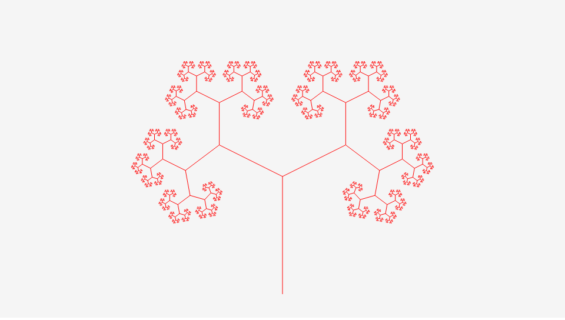

# CreateJS でフラクタルに挑戦しよう

## 再帰呼び出しを使おう

関数の中で、自分自身を呼び出すことができます。 これを、再帰呼び出しと呼びます。

```js
myFunc(10);

function myFunc(level){
  // 再帰呼び出しのレベルが0より大きかったら
  if(level > 0){
    console.log(level);

    // 再帰レベルを更新
    level = level - 1;
    // 再帰呼び出しをする
    myFunc(level);
  }else{
    // 再帰呼び出し終了
  }
}

```

グラフィックの分野ではフラクタル図形の描画に役立ちます。


## 三角形を描こう



- [サンプルを再生する](https://ics-creative.github.io/tutorial-createjs/samples/fractal_triangle.html)
- [サンプルのソースコードを確認する](../samples/fractal_triangle.html)

これはシェルピンスキーギャスケットと呼ばれるフラクタル図形の1種であり、無数の三角形からできています。ポーランドの数学者ヴァツワフ・シェルピンスキにちなんで名づけられれました。詳しくはWikipediaで紹介されているので参考にしてください。

[シェルピンスキーのギャスケット - Wikipedia](https://ja.wikipedia.org/wiki/%E3%82%B7%E3%82%A7%E3%83%AB%E3%83%94%E3%83%B3%E3%82%B9%E3%82%AD%E3%83%BC%E3%81%AE%E3%82%AE%E3%83%A3%E3%82%B9%E3%82%B1%E3%83%83%E3%83%88)



- [サンプルを再生する](https://ics-creative.github.io/tutorial-createjs/samples/fractal_triangle_steps.html)
- [サンプルのソースコードを確認する](../samples/fractal_triangle_steps.html)


再帰呼び出しの構造を確認しましょう。`level`変数が`5`から始まり、`0`になるまで再帰呼び出しによって繰り返し呼びだされます。

```js

// フラクタルの三角形を描く
drawTriangle(5, ・・・);

// 三角形を描く関数
function drawTriangle(level,・・・) {
    // 再帰レベルが0になったら描く
    if (level <= 0) {
        // 再帰終了
        // ①
    } else { // 再帰レベルが 0 になるまで細分化を行う

        // 正三角形の3辺の中点を求める
        // ②

        // 再帰レベルを更新
        level = level - 1;
        // 中点を元に細分化を行う
        drawTriangle(level, ・・・);
        drawTriangle(level, ・・・);
        drawTriangle(level, ・・・);
    }
}
```

①の部分では三角形を描きます。`lineTo()`と`moveTo()`メソッドを使って三角形を描きましょう。

```js
// 線の種類を設定
shape.graphics.beginStroke("DarkRed").setStrokeStyle(2.0);
// 三角形を描く
shape.graphics.moveTo(x1, y1); // 始点を設定
shape.graphics.lineTo(x2, y2); // 始点と2点目を結ぶ
shape.graphics.lineTo(x3, y3); // 2点目と3点目を結ぶ
shape.graphics.closePath(); // 始点まで結ぶ
```

②の部分では細分化のため、三角形の中点を求めます。

```js
// 正三角形の3辺の中点を求める
// 1辺目の中点
var nx1 = (x1 + x2) / 2;
var ny1 = (y1 + y2) / 2;
// 2辺目の中点
var nx2 = (x2 + x3) / 2;
var ny2 = (y2 + y3) / 2;
// 3辺目の中点
var nx3 = (x3 + x1) / 2;
var ny3 = (y3 + y1) / 2;
```


## 木を描こう



- [サンプルを再生する](https://ics-creative.github.io/tutorial-createjs/samples/fractal_tree.html)
- [サンプルのソースコードを確認する](../samples/fractal_tree.html)

```js
// 枝を描く
function drawTree(x1, // 始点のX座標
                  y1, // 始点のY座標
                  leng, // 枝の長さ
                  angle, // 枝の伸びる方向(角度)
                  level) // 再帰レベル
{
    // 次の枝の座標を算出
    var x2 = leng * Math.cos(angle * Math.PI / 180) + x1;
    var y2 = leng * Math.sin(angle * Math.PI / 180) + y1;
    // 線の種類を設定
    shape.graphics.setStrokeStyle(1).beginStroke("DarkRed");
    // 枝を結ぶ
    shape.graphics.moveTo(x1, y1);
    shape.graphics.lineTo(x2, y2);

    // 細分化
    if (level > 0) {
        // 細分化レベルを更新
        level = level - 1;

        // 次の枝を描く
        drawTree(x2, y2, leng * 0.6, angle + 80, level);
        drawTree(x2, y2, leng * 0.6, angle - 80, level);
    }
}
```


## アニメーションする木を描こう



- [サンプルを再生する](https://ics-creative.github.io/tutorial-createjs/samples/fractal_tree_animation.html)
- [サンプルのソースコードを確認する](../samples/fractal_tree_animation.html)

時間経過によって変数`time`の値が加算されるようにします。

```js
// 時間経過を変数でカウント
var time = 0;

createjs.Ticker.addEventListener("tick", handleTick);
function handleTick() {
  // シェイプをクリアする
  shape.graphics.clear();

  // フラクタルの木を描く
  drawTree(0, 0, 200, 0, 12);
  // 画面を更新
  stage.update();

  // 時間を更新
  time += 1;
}
```

`drawTree()`関数内部で枝の角度を決定する部分を、`time`変数依存にします。`time`変数は時間経過で変化するため、時間経過にしたがって枝の角度が変化します。

```js
// 枝を描く
function drawTree(x1, // 始点のX座標
                  y1, // 始点のY座標
                  leng, // 枝の長さ
                  angle, // 枝の伸びる方向(角度)
                  level) // 再帰レベル
{
  (省略)

  // 細分化
  if (level > 0) {
      // 細分化レベルを更新
      level = level - 1;

      // 三角関数で変動する値を得る (-1.0〜+1.0の周期になる)
      var timeValue = Math.sin(time * Math.PI / 180);
      var rot = 40 * ( timeValue + 1.0 ) + 20; // +20〜+100の値を得る

      // 次の枝を描く
      drawTree(x2, y2, leng * 0.6, angle + rot, level);
      drawTree(x2, y2, leng * 0.6, angle - rot, level);
  }
}
```


<article-author>[池田 泰延](https://twitter.com/clockmaker)</article-author>
<article-date-published>2015-12-03</article-date-published>
<article-date-modified>2018-02-20</article-date-modified>
