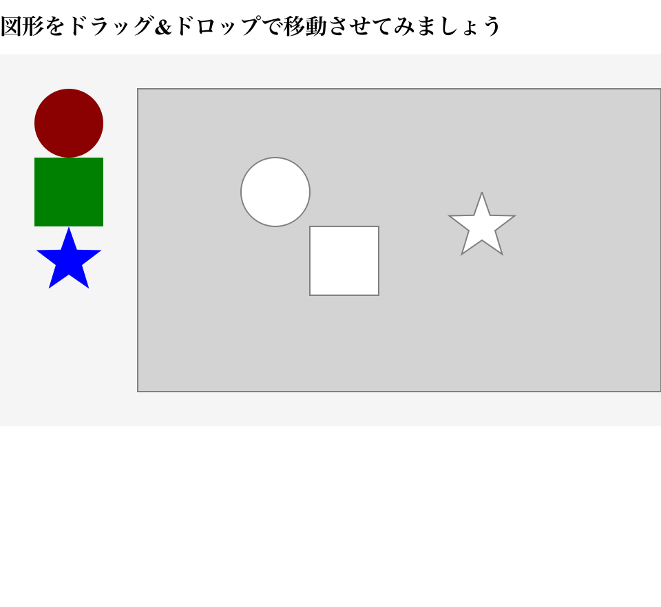

# CreateJS でパズルゲーム開発に挑戦しよう



- [サンプルを再生する](https://ics-creative.github.io/tutorial-createjs/samples/game_pazzle.html)
- [サンプルのソースコードを確認する](../samples/game_pazzle.html)

## ドラッグ・アンド・ドロップ

ドラッグ・アンド・ドロップの基本的な実装方法は次の[ドラッグ・アンド・ドロップの解説](mouse_drag.md)をご覧ください。

複数の表示オブジェクトに対して、同じイベントハンドラーの`handleMouseDown()`関数を登録します。`handleMouseDown()`関数では、引数の`event.currentTarget`を使うことで、どの表示オブジェクトでそのイベントが発生したのかを調べることができます。

```js
pieceCircle.addEventListener("mousedown", handleMouseDown);
pieceRect.addEventListener("mousedown", handleMouseDown);
pieceStar.addEventListener("mousedown", handleMouseDown);

function handleMouseDown(event) {
    // currentTarget を使うことで、どれがマウスダウンされたか判別できる
    var piece = event.currentTarget;
    // (省略)
}
```

ドラッグ・アンド・ドロップの実装は次の通りとなります。

```js
pieceCircle.addEventListener("mousedown", handleMouseDown);
pieceRect.addEventListener("mousedown", handleMouseDown);
pieceStar.addEventListener("mousedown", handleMouseDown);

function handleMouseDown(event) {
    // currentTarget を使うことで、どれがマウスダウンされたか判別できる
    var piece = event.currentTarget;

    //(省略)
    // マウスが押された場所を保存しておく
    var mouseDownX = stage.mouseX - piece.x;
    var mouseDownY = stage.mouseY - piece.y;

    // ドラッグ関連イベントを登録
    piece.addEventListener("pressmove", handlePressMove);
    piece.addEventListener("pressup", handlePressUp);

    function handlePressMove(event) {
        updateMousePosition(); // マウスの座標に追随
    }

    function handlePressUp(event) {
        updateMousePosition(); // マウスの座標に追随

        //(省略)

        // ドラッグ関連イベントを解除
        piece.removeEventListener("pressmove", handlePressMove);
        piece.removeEventListener("pressup", handlePressUp);
    }

    // マウスのドラッグ処理
    function updateMousePosition() {
        // オブジェクトの座標はマウスの座標に追随
        // ただしマウスダウンした場所のズレを補正
        piece.x = stage.mouseX - mouseDownX;
        piece.y = stage.mouseY - mouseDownY;
    }
}
```


## 吸着処理

対象とあたっているかを当たり判定をとり、当たり判定があるときに、対象のXY座標と同じ値を代入しましょう。

```js
// マウスアップされたときに、目標のシェイプとの当たり判定をとる
var pt = targetBase.localToLocal(0, 0, piece);
var isHit = piece.hitTest(pt.x, pt.y);
if (isHit == true) {
    // 吸着させる
    piece.x = targetBase.x;
    piece.y = targetBase.y;
}
```

<article-author>[池田 泰延](https://twitter.com/clockmaker)</article-author>
<article-date-published>2015-12-10</article-date-published>
<article-date-modified>2015-12-17</article-date-modified>
