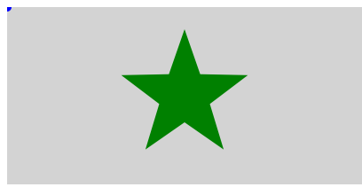
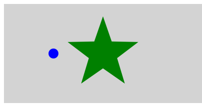
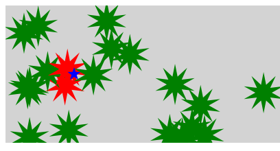

# CreateJS での当たり判定

オブジェクトの当たり判定の方法を学んでいきましょう。


## 点と表示オブジェクトとで当たり判定を取る

`hitTest()`を使用すると、点（座標）とインスタンスとの当たり判定を簡単にとる事ができます。当たり判定の測定には表示オブジェクトのローカル座標を利用する必要があるため、マウス座標と表示オブジェクトの当たり判定を計算したい場合は、`globalToLocal()`メソッドを使ってグローバル座標のマウス座標をローカル座標に変換するといいでしょう。

```js
// ●から見たマウス座標のローカル座標を求める
var point = ●.globalToLocal(stage.mouseX, stage.mouseY);
// マウス座標と●があたっているかを調べる
var isHit = ●.hitTest(point.x, point.y);

if(isHit == true){
  // あたっている時の処理
}else{
  // 離れている時の処理
}
```

サンプル



- [サンプルを再生する](https://ics-creative.github.io/tutorial-createjs/samples/hittest_mouse.html)
- [サンプルのソースコードを確認する](../samples/hittest_mouse.html)

マウス座標と表示オブジェクトが重なっていれば `true` が、重なっていなければ `false` が返ってきます。


※`hitTest()`メソッドの詳しい使い方は「[公式ドキュメント(英語)](http://createjs.com/docs/easeljs/classes/Shape.html#method_hitTest)」を確認ください。
※`globalToLocal()`メソッドの詳しい使い方は「[公式ドキュメント(英語)](http://createjs.com/docs/easeljs/classes/Shape.html#method_globalToLocal)」を確認ください。


## 表示オブジェクトと表示オブジェクトとで当たり判定を取る

`hitTest()`を使用すると、点（座標）とインスタンスとの当たり判定を簡単にとる事ができます。表示オブジェクト通しの判定の場合は、表示オブジェクト間の相対座標を`localToLocal()`メソッドを使って計算するといいでしょう。

```js
// ●と△の相対座標を求める
var point = △.localToLocal(0, 0, ●);
// △と●があたっているかを調べる
var isHit = ●.hitTest(point.x, point.y);

if(isHit == true){
  // あたっている時の処理
}else{
  // 離れている時の処理
}
```

サンプル



- [サンプルを再生する](https://ics-creative.github.io/tutorial-createjs/samples/hittest_object.html)
- [サンプルのソースコードを確認する](../samples/hittest_object.html)

表示オブジェクトと表示オブジェクトが重なっていれば `true` が、重なっていなければ `false` が返ってきます。

※`localToLocal()`メソッドの詳しい使い方は「[公式ドキュメント(英語)](http://createjs.com/docs/easeljs/classes/Shape.html#method_localToLocal)」を確認ください。


## 複数の表示オブジェクトと表示オブジェクトとで当たり判定を取る

複数の表示オブジェクトとの当たり判定をしたい場合は、表示オブジェクトを配列で保存して管理するといいでしょう。

サンプル



- [サンプルを再生する](https://ics-creative.github.io/tutorial-createjs/samples/hittest_object_multi.html)
- [サンプルのソースコードを確認する](../samples/hittest_object_multi.html)

表示オブジェクト生成時は配列 `polyList` に保存します。`polyList[i] = poly;`と書くことで配列の`i`番目に表示オブジェクトが保存されます。

```js
var polyList = []; // 複数の星とのアタリ判定のために配列を作成
// 星をいくつか作成します
for (var i = 0; i < 20; i++) {
    var poly = new createjs.Shape();
    stage.addChild(poly); // 表示リストに追加
    // (省略)

    // 配列に保存する
    polyList[i] = poly;
}
```

当たり判定のときには配列 `polyList` を `for` 文を使って全要素を走査します。`var poly = polyList[i];`と記述すれば、`i`番目の要素を参照することができます(`i`番目の要素がローカル変数の`poly`に一時的に代入される)。`i`番目のときの`poly`に当たり判定があるかどうかを調べればいいでしょう。

```js
// 時間経過のイベント
createjs.Ticker.addEventListener("tick", handleTick);
function handleTick() {
  // (省略)

  // 複数の星とのアタリ判定をfor文でチェックする
  for (var i = 0; i < polyList.length; i++) {
    // 配列の要素を参照する (i番目の星)
    var poly = polyList[i]; // i 番目の poly を取得

    // 小さな星とi番目の星の相対座標を求める
    var point = miniStar.localToLocal(0, 0, poly);
    // i番目の星と小さな星があたっているかを調べる
    var isHit = poly.hitTest(point.x, point.y);

    // あたっていれば
    if (isHit == true) {
      // 星を赤色で塗る
      // (省略)
    } else {
      // 星を緑色で塗る
      // (省略)
    }
  }

  // (省略)
}
```

<article-author>[池田 泰延](https://twitter.com/clockmaker)</article-author>
<article-date-published>2015-11-30</article-date-published>
<article-date-modified>2015-12-24</article-date-modified>
