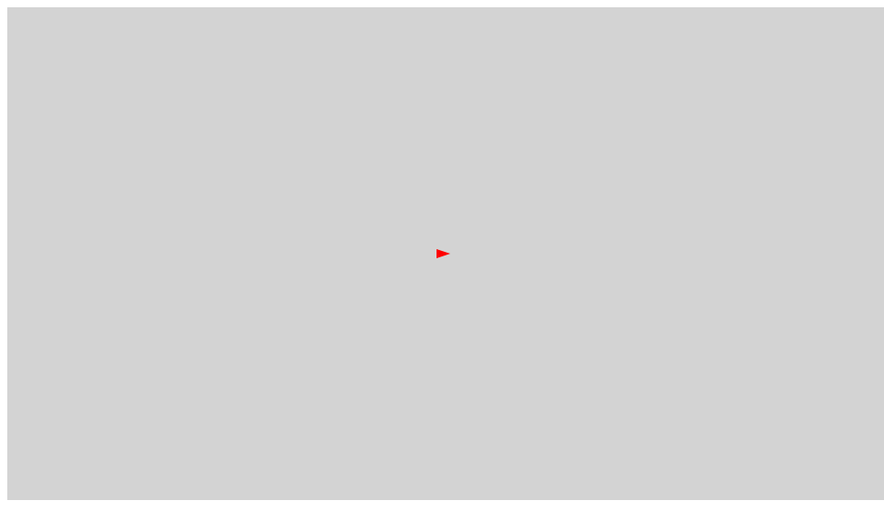
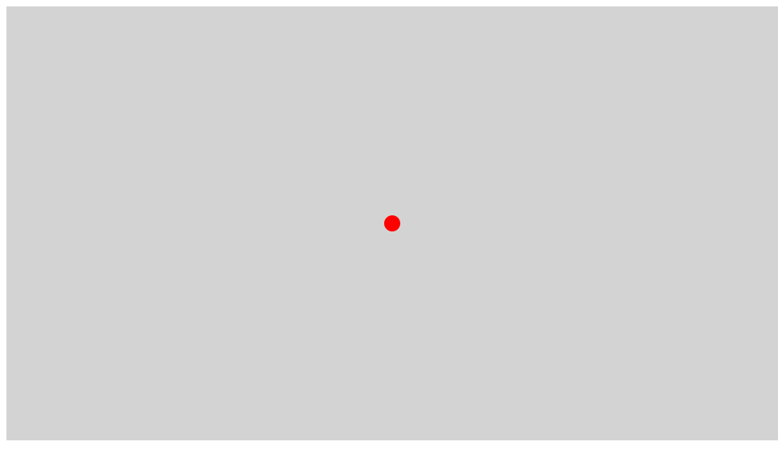
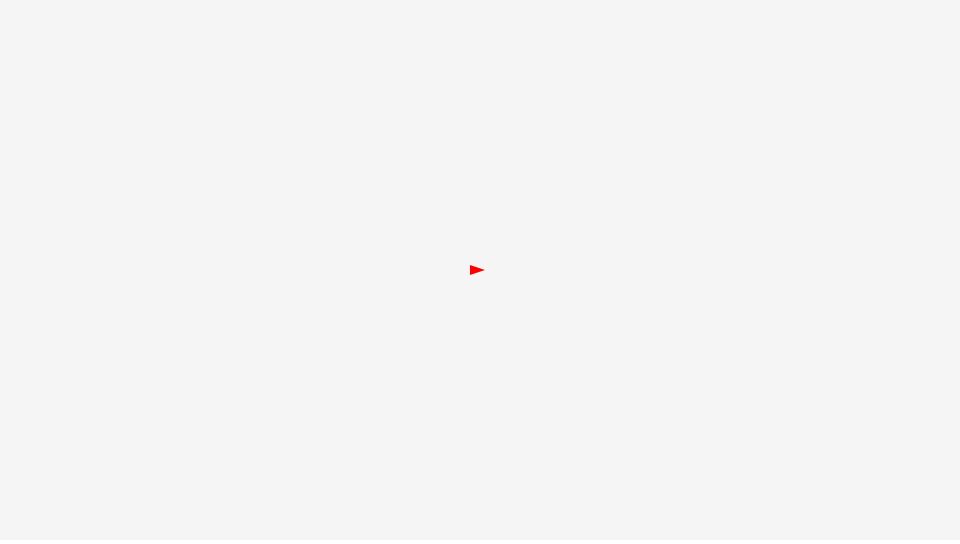

## 船をキーボードで上下左右に移動する



- [サンプルを再生する](https://ics-creative.github.io/tutorial-createjs/samples/keyboard_ship_basic.html)
- [サンプルのソースコードを確認する](../samples/keyboard_ship_basic.html)


キーボードで表示オブジェクトを動かすサンプルを通して、キーボードイベントを理解しましょう。次のサンプルはキーボードが押されたタイミングで、表示オブジェクトの`x`, `y`座標を移動し、`rotation`で角度を変えています。

```js
// シェイプ(船)を作成
var ship = new createjs.Shape();
// (省略)
stage.addChild(ship);

// キーボードを押したタイミングを検知
window.addEventListener("keydown", handleKeyDown);

function handleKeyDown(event) {
  // キーコード(どのキーが押されたか)を取得
  var keyCode = event.keyCode;
  console.log(event.keyCode);
  // 条件文で船の位置を変更する
  if (keyCode == 39) { // 右
    ship.x += 1; // 移動
    ship.rotation = 0; // 向きを変更
  } else if (keyCode == 37) { // 左
    ship.x -= 1;
    ship.rotation = 180;
  } else if (keyCode == 40) { // 下
    ship.y += 1;
    ship.rotation = 90;
  } else if (keyCode == 38) { // 上
    ship.y -= 1;
    ship.rotation = -90;
  }
}
```

直行座標で管理しているので、コードはシンプルです。しかし斜めに動かすということができないので、次はアングルという概念を持ち込んでみます。


## キーボード押下の処理



- [サンプルを再生する](https://ics-creative.github.io/tutorial-createjs/samples/keyboard_ship_basic_tick.html)
- [サンプルのソースコードを確認する](../samples/keyboard_ship_basic_tick.html)


キーボードの制御処理をつくるときのコツを紹介します。先程までは`keydown`イベントでキー入力と、自機の操作を同じ関数で実行していました。しかしこの実装方法では2つ課題があります。

- パソコンのキーボードの種類によってはキー入力の頻度が異なるため、マシンによっては`keydown`イベントが高い頻度で発生する可能性があります。そうなってくると、ゲームの公平性が失われる可能性があります。
- 斜めの移動ができない

これらの対策のためには、キー押下のタイミングとゲーム内部処理を分離するといいでしょう。次のコードでは、キーが押されているかを判定する真偽値の変数を用意しています。処理は`tick`イベントでのみ行われます。こうすることで、キー入力の頻度に関わらず、自機の操作は`tick`イベントのみとなるためマシン依存なくゲーム開発ができるようになります。

```js
// キーボードが押されているかの判定を行う
var isPressLeft = false;
var isPressRight = false;
var isPressUp = false;
var isPressDown = false;

// キーボードを押したタイミングを検知
window.addEventListener("keydown", handleKeyDown);
window.addEventListener("keyup", handleKeyUp);
function handleKeyDown(event) {
  // キーコード(どのキーが押されたか)を取得
  var keyCode = event.keyCode;
  if (keyCode == 39) { // 右
    isPressRight = true;// 真偽値が切り替わる
  } else if (keyCode == 37) { // 左
    isPressLeft = true;
  } else if (keyCode == 40) { // 下
    isPressDown = true;
  } else if (keyCode == 38) { // 上
    isPressUp = true;
  }
}

function handleKeyUp(event) {
  // キーコード(どのキーが押されたか)を取得
  var keyCode = event.keyCode;
  if (keyCode == 39) { // 右
    isPressRight = false;// 真偽値が切り替わる
  } else if (keyCode == 37) { // 左
    isPressLeft = false;
  } else if (keyCode == 40) { // 下
    isPressDown = false;
  } else if (keyCode == 38) { // 上
    isPressUp = false;
  }
}

// 時間経過
createjs.Ticker.addEventListener("tick", handleTick);
function handleTick() {
  // 条件文で船の位置を変更する
  if (isPressRight == true) { // 右
    ship.x += 1; // 移動
  } else if (isPressLeft == true) { // 左
    ship.x -= 1;
  }
  if (isPressDown == true) { // 下
    ship.y += 1;
  } else if (isPressUp == true) { // 上
    ship.y -= 1;
  }
  stage.update(); // 画面更新
}
```


## 船にハンドル操作を実装する



- [サンプルを再生する](https://ics-creative.github.io/tutorial-createjs/samples/keyboard_ship_vector.html)
- [サンプルのソースコードを確認する](../samples/keyboard_ship_vector.html)

左右のカーソルキーで船の進行方向を、上下キーで前進後進のアクセルを実装してみましょう。次のコードは`angle`と`speed`という変数で数値として管理しています。

```js
var angle = 0; // 船の角度
var speed = 0; // 船の移動の速さ

// キーボードを押したタイミングを検知
window.addEventListener("keydown", handleKeyDown);

function handleKeyDown(event) {
  // キーコード(どのキーが押されたか)を取得
  var keyCode = event.keyCode;
  // 条件文で船の位置を変更する
  if (keyCode == 39) { // 右
    angle += 5;
  } else if (keyCode == 37) { // 左
    angle -= 5;
  }

  if (keyCode == 40) { // 下
    speed -= 1;
  } else if (keyCode == 38) { // 上
    speed += 1;
  }
}
```

次に`tick`イベントにて船のアングルとスピードを反映させていきましょう。

```js
// 時間経過
createjs.Ticker.addEventListener("tick", handleTick);
function handleTick() {
  // angle と speed を ship に適用する

  stage.update(); // 画面更新
}
```

まずはangleを使って船の角度を設定しましょう。

```js
// 船の角度を設定する
ship.rotation = angle;
```

その次は船の進行方向に向かって、船を前進させましょう。船の速さを角度で分解する必要があります。`speed`と`angle`は極座標の情報であるため、三角関数を使って直交座標の成分に変換します。

```js
// 角度をラジアンに変換
var radian = angle * Math.PI / 180;
// スピード(スカラ)と方向からxとyの成分に分解
var vx = speed * Math.cos(radian);
var vy = speed * Math.sin(radian);
```

ここで求めたvxとvyは直交座標の成分であるため、xとy座標に適用します。

```js
// 船の位置を更新する
ship.x += vx;
ship.y += vy;
```

次に摩擦を実装します。摩擦(抵抗)によって時間経過でスピードが減少するので、`speed`の値が小さくなっていくようにします。これは次のコードで実装することができます。`tick`イベントが起きる度に、`speed` の値は 90% まで小さくなるという式です。

```js
// 摩擦
speed *= 0.90;
```

### 画面端の処理を実装する

画面端からはみ出ないように制御しましょう。`x`, `y`座標を見て、領域を超えそうになったときに元の場所に戻す処理を記述します。

```js
// 画面端の処理を入れる
if (ship.x < 0) { ship.x = 0; }
if (ship.x > stage.canvas.width) { ship.x = stage.canvas.width; }
if (ship.y < 0) { ship.y = 0; }
if (ship.y > stage.canvas.height) { ship.y = stage.canvas.height; }
```

[次の記事へ](hittest.md)

