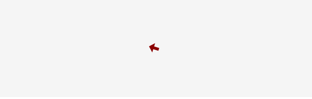
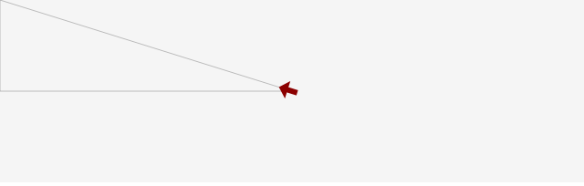

# CreateJS で三角関数を活用しよう

ここでは三角関数を使った様々な計算の手法を学んでいきましょう。三角関数はあらゆる実装の基本となるため、この解説をおさえて応用のための基礎知識をつけておきましょう。

## マウスの方向を向かせる

画面上の矢印を、常にマウスを向くように実装してみましょう。



- [サンプルを再生する](https://ics-creative.github.io/tutorial-createjs/samples/math_atan.html)
- [サンプルのソースコードを確認する](../samples/math_atan.html)

これ実現している主なコードは次の部分です。`tick`イベントの処理でマウスの方向を向くように`rotation`プロパティーを変化させています。

```js
// 時間経過
createjs.Ticker.addEventListener("tick", handleTick);
  function handleTick() {
  // マウス座標との差分を計算
  var dx = stage.mouseX - arrow.x;
  var dy = stage.mouseY - arrow.y;
  // 差分を元に方向を計算
  var radians = Math.atan2(dy, dx);
  // ラジアンを角度に変換
  var degrees = radians * 180 / Math.PI;
  // 表示オブジェクトの角度に反映
  arrow.rotation = degrees;

  stage.update(); // 画面更新
}
```

計算の手段として、対象物`arrow`とマウス座標がどれだけ離れているか計算します。それは2点の座標をそれぞれ引き算すれば求めることができます。三角関数ではアークタンジェントを使うことで、X成分とY成分からラジアン角を求めることができます。



JavaScriptでは`Math.atan2(y, x)`関数がアークタンジェントを計算する命令となります。この関数の第一引数は`y`で、第二引数が`x`であることに注意してください。ラジアン角は`180 / Math.PI`を掛け算することで角度に変換し、表示オブジェクトの`rotation`プロパティーに代入します。

今回はマウスの座標を使いましたが、異なる座標でも同様に計算に使うことができます。例えばゲームで敵キャラクターが自機(プレイヤー)を向かせるといったことに応用してみるといいでしょう。


## 2点間の距離を求める

マウスと表示オブジェクトがどれだけ離れているか距離を測定してみましょう。


- [サンプルを再生する](https://ics-creative.github.io/tutorial-createjs/samples/math_distance.html)
- [サンプルのソースコードを確認する](../samples/math_distance.html)

これ実現している主なコードは次の部分です。`tick`イベントの処理で計算していますが、`distance`変数の部分に注目ください。

```js
// 時間経過
createjs.Ticker.addEventListener("tick", handleTick);
function handleTick() {
  // 距離を計算
  var dx = ball.x - stage.mouseX;
  var dy = ball.y - stage.mouseY;
  var distance = Math.sqrt(dx * dx + dy * dy);
  // ラベルに距離を表示
  label.text = distance + "px";

  // 二点間を線分でつなぐ
  shape.graphics.clear()
         .setStrokeStyle(1).beginStroke("gray")
         .moveTo(ball.x, ball.y)
         .lineTo(stage.mouseX, stage.mouseY);

  stage.update(); // 画面更新
}
```

2点間の距離を測定するには三平方の定理(ピタゴラスの定理)を使います。三角形の底辺と高さをそれぞれ二乗したものを足し算して、その平方根をとると斜辺の長さになるいう定理です。

底辺はX方向の差分として`dx`を求め、高さはY方向の差分として`dy`を求めます。定理に従って、それぞれを二乗し、平方根を求めるために`Math.sqrt()`関数(sqrt = スクウェア・ルート = 平方根)を使っています。

対象物からどれだけ距離が離れているかは、演出に役立てることもできます。対象物に近いほど過剰に演出して、対象物から離れていると静かに待機するといった使い分けにも役立てることができるでしょう。

[次の記事へ](math_trigonometry.md)

<article-author>[池田 泰延](https://twitter.com/clockmaker)</article-author>
<article-date-published>2015-12-20</article-date-published>
<article-date-modified>2018-02-20</article-date-modified>
