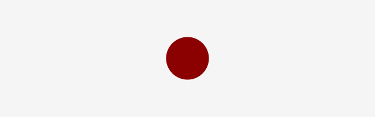
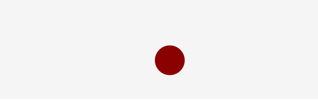
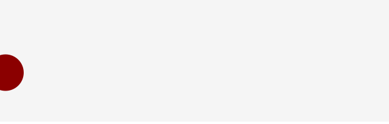
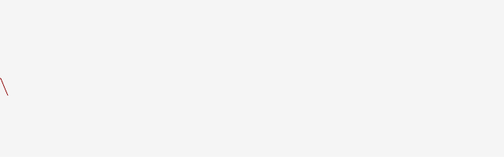
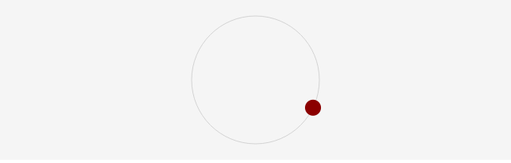
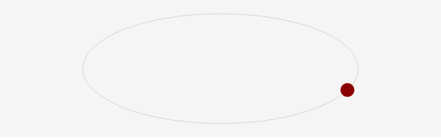

# CreateJS で三角関数モーションを理解しよう

ここでは三角関数を使った周期的なモーションの実装方法を学んでいきましょう。

## 上下振幅のモーション

三角関数の`Math.sin()`は周期的なモーションを作るのに便利な関数です。引数にはラジアンを渡せば、`-1.0`から`+1.0`までのいずれかの結果(戻り値)を得ることができます。つまり、この範囲に収まる数値を得るのに三角関数が役立つということです。具体的な例として、次のサンプルではボールが上下に移動するモーションを実装しています。


- [サンプルを再生する](https://ics-creative.github.io/tutorial-createjs/samples/math_sin_updown.html)
- [サンプルのソースコードを確認する](../samples/math_sin_updown.html)

上下の移動を実現しているコードは次の部分です。`tick`イベントの処理で上下移動するように`y`座標を変化さえています。

```js
var angle = 0;

// 時間経過
createjs.Ticker.addEventListener("tick", handleTick);
function handleTick() {
 ball.y = 100 + Math.sin(angle) * 50;
 angle += 0.1;
}
```

三角関数の`Math.sin(angle)`が`-1.0`から`+1.0`までの値になるので、`50`を掛け算して`-50.0`から`+50.0`までの値となるようにしています。ここに中心座標となる`100`を加えることで、結果的には`50`〜`150`のY座標を得ています。三角関数の引数となる`angle`は時間経過で`0.1`ずつ増加しますが、このことによって`50`〜`150`の範囲に`y`座標がスムーズに変化するようになります。

汎用的にするために、コードに直接書いている数値を変数に変えてみましょう。変数名が役割を示しているので見通しがよくなったのではないでしょうか。

```js
var centerY = 100;
var range = 50;
var angle = 0;
var speed = 0.1;

// 時間経過
createjs.Ticker.addEventListener("tick", handleTick);
function handleTick() {
 ball.y = centerY + Math.sin(angle) * range;
 angle += speed;
}
```

以降は、このテンプレートにそってコードを解説していきます。

## サイズの振幅

三角関数による周期的なモーションはY座標のみならず、他のプロパティーに対しても適用することができます。次の例では、スケールに対して三角関数を利用しています。



- [サンプルを再生する](https://ics-creative.github.io/tutorial-createjs/samples/math_sin_pulse.html)
- [サンプルのソースコードを確認する](../samples/math_sin_pulse.html)

これを実現している主なコードは次の通りです。適用するのは`scaleX`と`scaleY`プロパティーの2つです。水平と垂直の両方のスケールを変化させることで、拡大・縮小するモーションとなっています。

```js
var angle = 0;
var centerScale = 1.0;
var range = 0.5;
var speed = 0.05;

// 時間経過
createjs.Ticker.addEventListener("tick", handleTick);
function handleTick() {
  // スケールを変化
  ball.scaleX = ball.scaleY
          = centerScale + Math.sin(angle) * range;
  angle += speed;
}
```

## 2つの角度を利用する

プロパティーごとに異なる角度で制御してみましょう。

<<<<<<< HEAD


- [サンプルを再生する](https://ics-creative.github.io/tutorial-createjs/samples/math_sin_pulse.html)
- [サンプルのソースコードを確認する](../samples/math_sin_pulse.html)
=======


- [サンプルを再生する](https://ics-creative.github.io/tutorial-createjs/samples/math_sin_twoangles.html)
- [サンプルのソースコードを確認する](../samples/math_sin_twoangles.html)
>>>>>>> features/tool-generate-html

XとY座標それぞれにことなる三角関数の角度を適用するため、変数を増やして制御しています。

```js
var angleX = 0;
var angleY = 0;
var centerX = 320;
var centerY = 100;
var range = 50;
var speedX = 0.08;
var speedY = 0.12;

// 時間経過
createjs.Ticker.addEventListener("tick", handleTick);
function handleTick() {
  ball.x = centerX + Math.sin(angleX) * range;
  ball.y = centerY + Math.sin(angleY) * range;
  angleX += speedX;
  angleY += speedY;
}
```

`speedX`と`speedY`に異なるスピードを設定しているので、X方向とY方向の動き方に変化を加えることができました。

## 振幅のある移動

振幅しながら横に移動するモーションを作ってみましょう。

<<<<<<< HEAD

=======

>>>>>>> features/tool-generate-html

- [サンプルを再生する](https://ics-creative.github.io/tutorial-createjs/samples/math_sin_vertical.html)
- [サンプルのソースコードを確認する](../samples/math_sin_vertical.html)

これを実現している主なコードは次の通りです。

```js
var angle = 0;
var centerY = 100;
var range = 50;
var xSpeed = 1;
var ySpeed = 0.05;

// 時間経過
createjs.Ticker.addEventListener("tick", handleTick);
function handleTick() {
  ball.x += xSpeed;
  ball.y = centerY + Math.sin(angle) * range;
  angle += ySpeed;

  // (省略)
}
```

X座標の`px`は単純増加させ、Y座標の`py`は三角関数によって求めた値を使っています。

## 三角波を描く

サインカーブ(三角波)を三角関数を使って描いてみましょう。

<<<<<<< HEAD


- [サンプルを再生する](https://ics-creative.github.io/tutorial-createjs/samples/math_sin_pulse.html)
- [サンプルのソースコードを確認する](../samples/math_sin_pulse.html)
=======


- [サンプルを再生する](https://ics-creative.github.io/tutorial-createjs/samples/math_sin_drawing.html)
- [サンプルのソースコードを確認する](../samples/math_sin_drawing.html)
>>>>>>> features/tool-generate-html

これを実現している主なコードは次の通りです。

```js
var angleY = 0;
var centerY = 100;
var range = 50;
var speedX = 1;
var speedY = 0.05;

var px = 0;

shape.graphics
  .setStrokeStyle(1)
  .beginStroke("DarkRed")
  .moveTo(0, centerY);

// 時間経過
createjs.Ticker.addEventListener("tick", handleTick);
function handleTick() {
  // X座標の計算
  px += speedX;
  // Y座標の計算
  var py = centerY + Math.sin(angleY) * range;
  angleY += speedY;
  // 線を描画
  shape.graphics.lineTo(px, py);
}
```

X座標の`px`は単純増加させ、Y座標の`py`は三角関数によって求めた値を使っています。


## 円運動

円周上をうごくモーションを作ってみましょう。



- [サンプルを再生する](https://ics-creative.github.io/tutorial-createjs/samples/math_sin_cos.html)
- [サンプルのソースコードを確認する](../samples/math_sin_cos.html)

これを実現している主なコードは次の通りです。今までは`Math.sin()`関数のみでしたが、今回は`Math.cos()`関数も使っています。

```js
var angle = 0;
var centerX = 320;
var centerY = 100;
var radius = 80;
var speed = 0.05;

// 時間経過
createjs.Ticker.addEventListener("tick", handleTick);
function handleTick() {
  ball.x = centerX + Math.cos(angle) * radius;
  ball.y = centerY + Math.sin(angle) * radius;
  angle += speed;

  stage.update(); // 画面更新
}
```

X座標の計算には`Math.cos()`関数を、Y座標の計算には`Math.sin()`関数を使っています。重要なことはそれぞれの関数に与えている引数は同じ`angle`を使っているということです。

## 楕円運動

楕円の円周上をうごくモーションを作ってみましょう。



- [サンプルを再生する](https://ics-creative.github.io/tutorial-createjs/samples/math_sin_ellipse.html)
- [サンプルのソースコードを確認する](../samples/math_sin_ellipse.html)

これを実現している主なコードは次の通りです。

```js
var angle = 0;
var centerX = 320;
var centerY = 100;
var radiusX = 200;
var radiusY = 80;
var speed = 0.05;

// 時間経過
createjs.Ticker.addEventListener("tick", handleTick);
function handleTick() {
  ball.x = centerX + Math.cos(angle) * radiusX;
  ball.y = centerY + Math.sin(angle) * radiusY;
  angle += speed;

  stage.update(); // 画面更新
}
```

X座標の計算には`radiusX`を、Y座標の計算には`radiusX`を使っています。X方向の半径と、Y方向の半径を異なる数値にするだけで、楕円円周が実現できます。

[前の記事へ](math_basic.md)
