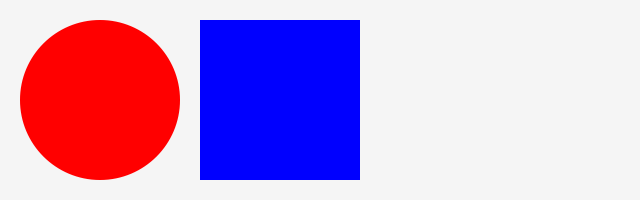

## クリック

表示オブジェクトをクリックしたときのイベントの処理を作るには、`click`イベントを監視します。

書式

```js
// イベントを登録
表示オブジェクト.addEventListener("click", handleClick);
// クリックしたとき
function handleClick(event){
	// 処理
}
```

サンプルとして異なる２つのシェイプに対して、クリックしたときの処理を作ってみましょう。異なる２つのシェイプそれぞれに`click`イベントを登録します。

```js
// 円の作成
var circle = new createjs.Shape();
circle.graphics.beginFill("DarkRed").drawCircle(100, 100, 80);
stage.addChild(circle);

// 四角形の作成
var rect = new createjs.Shape();
rect.graphics.beginFill("blue").drawRect(200, 20, 160, 160);
stage.addChild(rect);

// 各種マウスイベントを登録する
circle.addEventListener("click", handleCircleClick);
rect.addEventListener("click", handleRectClick);

// クリックしたとき
function handleCircleClick(event) {
  alert("円がクリックされました");
}

function handleRectClick(event) {
  alert("四角形がクリックされました");
}
```



- [サンプルを再生する](https://ics-creative.github.io/tutorial-createjs/samples/mouse_click.html)
- [サンプルのソースコードを確認する](../samples/mouse_click.html)

[次の記事へ](mouse_over.md)
