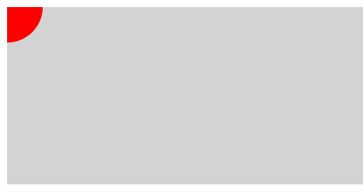

# CreateJS のマウスオーバー/マウスアウトの実装方法

マウスイベントのマウスオーバーやマウスアウトを利用したい場合は、Stageオブジェクトの`stage.enableMouseOver()`メソッドを実行して有効にします。

サンプルを紹介します。画面に円を表示し、マウスオーバーで色が変わり、マウスアウトで元の色に戻るというインタラクションを設定しました。マウスクリックでアラート表示されるようになっています。

書式

```js
// ステージを作成
var stage = new createjs.Stage("myCanvas");

// マウスオーバーを有効にする
stage.enableMouseOver();
```

```js
// 各種マウスイベントを登録する
表示オブジェクト.addEventListener("mouseover", handleMouseOver);
表示オブジェクト.addEventListener("mouseout", handleMouseOut);
表示オブジェクト.addEventListener("click", handleClick);

// マウスオーバーしたとき
function handleMouseOver(event) {
	// 処理
}

// マウスアウトしたとき
function handleMouseOut(event) {
	// 処理
}

// クリックしたとき
function handleClick(event) {
	// 処理
}
```

次のサンプルではマウスカーソルが四角形の中に入ると緑色のサークルに色が変わります。マウスカーソルがま薄アウトすると元の赤色に戻ります。

```js
// 各種マウスイベントを登録する
shape.addEventListener("mouseover", handleMouseOver);
shape.addEventListener("mouseout", handleMouseOut);

// マウスオーバーしたとき
function handleMouseOver(event) {
	// 緑で塗り直す
	shape.graphics
			.clear()
			.beginFill("green")
			.drawCircle(0, 0, 80);
}

// マウスアウトしたとき
function handleMouseOut(event) {
	// 赤で塗り直す
	shape.graphics
			.clear()
			.beginFill("DarkRed")
			.drawCircle(0, 0, 80);
}
```




- [サンプルを再生する](https://ics-creative.github.io/tutorial-createjs/samples/mouse_over.html)
- [サンプルのソースコードを確認する](../samples/mouse_over.html)

[次の記事へ](mouse_drag.md)
