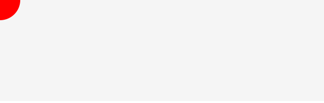

# CreateJS でマウス座標を調べる方法

CreateJSにはマウスイベントを管理する機能が備わっています。簡単なインタラクションの実装例を通して学習していきましょう。

## マウス座標

ステージ上のマウス座標は`stage.mouseX`と`stage.mouseY`プロパティーから取得することができます。

```js
// マウス座標を取得する
var mx = stage.mouseX;
var my = stage.mouseY;
```

マウスに追随してシェイプを移動させてみましょう。マウス座標ははリアルタイムで変動するので、`tick`イベント内で処理するといいでしょう。

```js
// ステージを作成
var stage = new createjs.Stage("myCanvas");

// オブジェクトの作成
var shape = new createjs.Shape();
shape.graphics.beginFill("red");
shape.graphics.drawCircle(0, 0, 40);
stage.addChild(shape);

// tick イベントを登録する
createjs.Ticker.addEventListener("tick", handleTick);

function handleTick(event) {
	// マウス座標を取得する
	var mx = stage.mouseX;
	var my = stage.mouseY;
	// シェイプをマウスに追随させる
	shape.x = mx;
	shape.y = my;

	// 画面を更新する
	stage.update();
}
```



- [サンプルを再生する](https://ics-creative.github.io/tutorial-createjs/samples/mouse_xy.html)
- [サンプルのソースコードを確認する](../samples/mouse_xy.html)


[目次に戻る](index.md)
