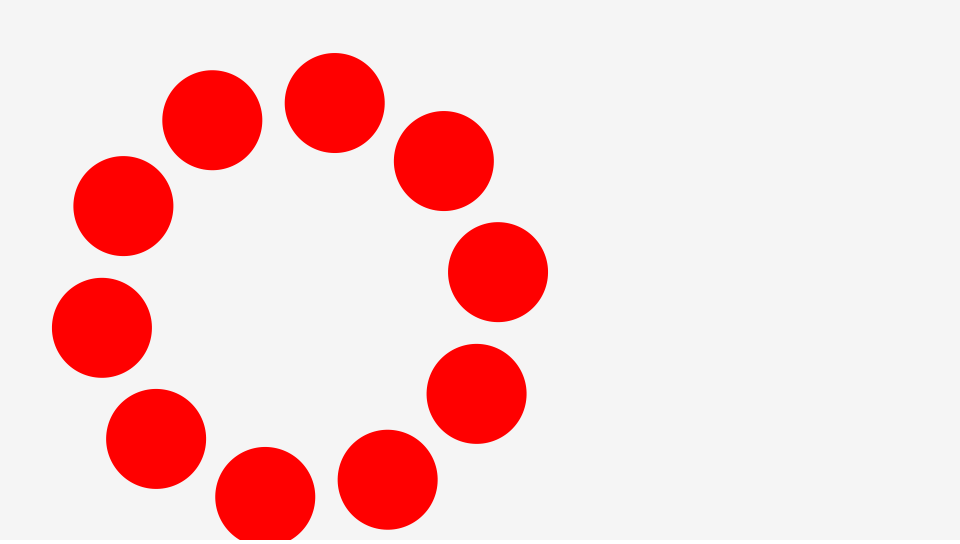

# CreateJS の表示オブジェクトの親子構造

表示オブジェクトは親のプロパティーによって、子の表示も影響を受けるので、グループ化して表示の制御を行いたい場合に親子構造を利用すると便利です。`createjs.Container`クラスを使うことで表示オブジェクトの親子構造を作ることができます。`createjs.Container`のインスタンスの中に、別の`createjs.Container`インスタンスを追加することもできるので、何重にもネストすることが可能です。

▼書式
```js
var container = new createjs.Container();
container.addChild(表示オブジェクト);
stage.addChild(container);
```

サンプルでは、親となる入れ物(`container`インスタンス)を用意して、そこに10個の`createjs.Shape`オブジェクトを円周上に配置するように`addChild()`メソッドを使って追加しています。`tick()`関数では`container`インスタンスしか`rotation`プロパティーを変化させていませんが、`container`インスタンス内に追加した`createjs.Shape`オブジェクトがまとめて移動しています。このように表示オブジェクトをネストさせることで、まとめてオブジェクトの移動や回転、拡縮の制御が容易にすることができます。




- [サンプルを再生する](https://ics-creative.github.io/tutorial-createjs/samples/container_nest.html)
- [サンプルのソースコードを確認する](../samples/container_nest.html)


複数のShapeオブジェクトが円周上を移動している


※`createjs.Container`クラスの詳しい使い方は「 [公式ドキュメント(日本語訳)](http://createjs.sub.jp/ja/EaselJS/reference/classes/Container.html)」を確認ください。
