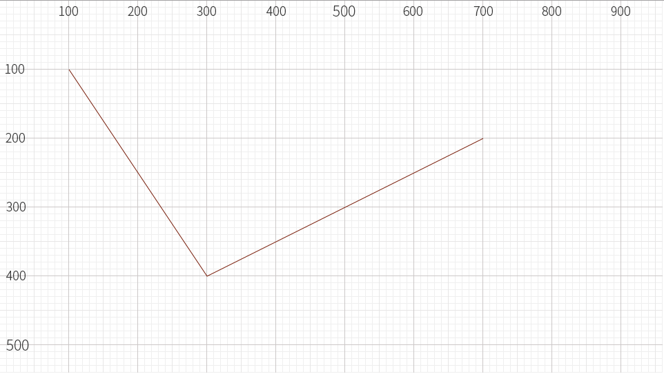
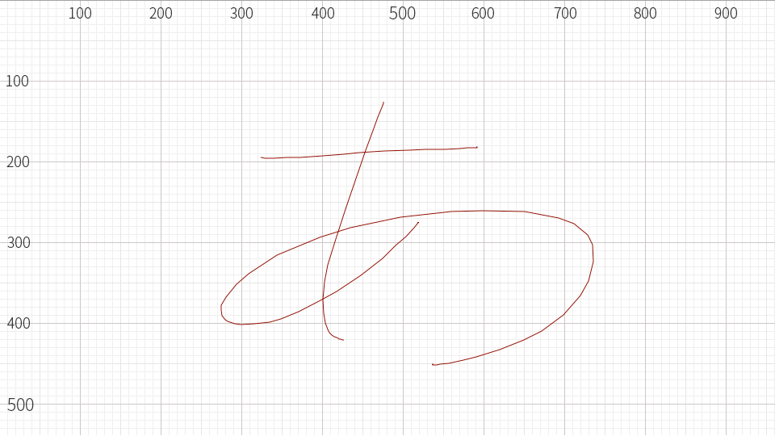
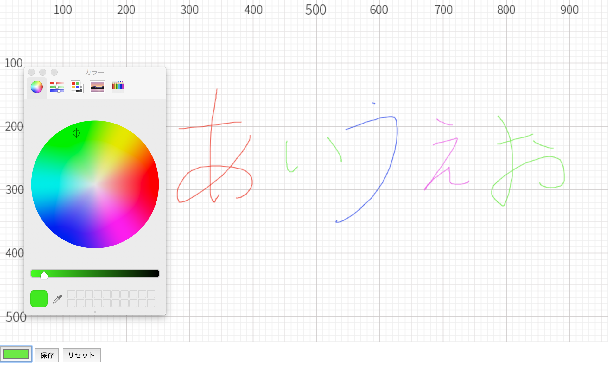
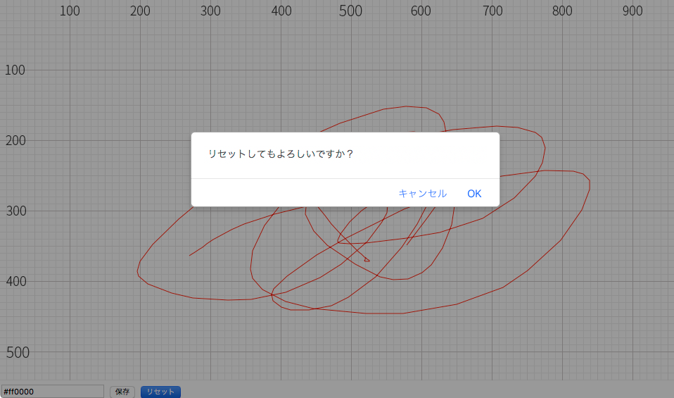

# CreateJS でお絵描きツールを作ろう


HTML5の`canvas`タグを使ってお絵描きツールを作ってみましょう。今回のサンプルは3段階で解説します。簡単な線を描くサンプル、お絵かきのための基本機能を説明したサンプル、そして本格的なお絵かき機能のサンプルです。

## ステップ1：JavaScriptで直線を描画する

まずは今までのCreateJS入門サイトの復習もかねて、頂点をつなぎあわせてラインを描くコードを作ってみましょう。

背景には方眼紙の背景画像を配置しています。方眼紙を敷いておけば座標がわかりやすくなるため、どの位置に線を描いているのか確認に役立ちます。なお、CreateJSでは画面の左上が`(0, 0)`座標で右方向にX座標が大きくなり、下方向にY座標が大きくなります。



- [サンプルを再生する](https://ics-creative.github.io/tutorial-createjs/samples/paint_step1.html)
- [サンプルのソースコードを確認する](../samples/paint_step1.html)

### 線の描画手順

線や図形を描くには、表示オブジェクトとなる`createjs.Shape`クラスを利用します。`createjs.Shape`クラスのインスタンスを作成し、画面上に`addChild()`メソッドを使って配置します。

```js
// Stageオブジェクトを作成。表示リストのルートになります。
var stage = new createjs.Stage("myCanvas");

// 描画をするためのシェイプを作成
var shape = new createjs.Shape();

// シェイプをステージに配置
stage.addChild(shape);
```

### 線のスタイルを設定

線を描画する手順としては、線のスタイルを設定し、開始点と終点の指定という2段階の手続きをとります。`createjs.Shape`インスタンスに存在する`graphics`プロパティ(`createjs.Graphics`クラス)を使って描画関数を呼びだします。
`beginStroke()`メソッドで塗りの色を指定します。

```js
// 線のスタイルを設定
shape.graphics
    .beginStroke("DarkRed"); // 赤色で線の描画を開始
```


### 線を描画する

線を描画するのは`moveTo()`メソッドと`lineTo()`メソッドです。`moveTo()`メソッドで開始点を指定し、`lineTo()`メソッドで指定位置まで線を描画します。`lineTo()`メソッドを連続して呼び出すと、前回の線の描画の終了位置から線を再描画するので、折れ線が描画されます。

```js
// 線の曲線を指定
shape.graphics
    .moveTo(100, 100) // 描画開始位置を指定
    .lineTo(300, 400) // 線の終了位置を指定
    .lineTo(700, 200);
```

## ステップ2：マウスドラッグによる線の描画

マウスのドラッグ＆ドロップを制御してお絵かきの基本機能を作っていきましょう。



- [サンプルを再生する](https://ics-creative.github.io/tutorial-createjs/samples/paint_step2.html)
- [サンプルのソースコードを確認する](../samples/paint_step2.html)


### マウスのドラッグで線を描画する手順

マウスのドラッグで線を描画するためには、マウスをダウンしている時のみ描画処理を行い、ドラッグした位置に線を描画するという処理手順となります。

マウスの左ボタンを押した時の反応は、`stage`インスタンスに対して`stagemousedown`イベントを監視することでチェックできます。`stagemousedown`イベントが発生したら`handleDown()`関数が呼び出されるように指定します。


```js
// ステージ上でマウスボタンを押した時のイベント設定
stage.addEventListener("stagemousedown", handleDown);

// マウスを押した時に実行される
function handleDown(event) {
  // ・・・
}
```

### マウスのドラッグ開始時の処理

`handleDown()`関数では描画を始める準備をします。線の開始点はマウス座標を指定するのですが、`event`引数の`stageX`と`stageY`プロパティーを使います。また、この関数では同時にマウスの移動とマウスボタンの離したタイミングを監視するために、`stagemousemove`イベントと`stagemouseup`イベントを`addEventListener()`メソッドで登録しています。

```js
// マウスを押した時に実行される
function handleDown(event) {
  // 線の描画を開始
  shape.graphics
    .beginStroke("DarkRed") // 青色で、描画を開始

  shape.graphics.moveTo(event.stageX, event.stageY) // 描画開始位置を指定

  // ステージ上でマウスを動かした時と離した時のイベント設定
  stage.addEventListener("stagemousemove", handleMove);
  stage.addEventListener("stagemouseup", handleUp);
}

// マウスが動いた時に実行する
function handleMove(event) {
  // ・・・
}

// マウスボタンが離された時に実行される
function handleUp(event) {
  // ・・・
}
```


### マウスのドラッグ中の処理

マウスを押した状態でマウスを動かした時のみ、`handleMove(event)`関数が呼び出されます。この時、「過去の位置からマウスをドラッグした位置まで線を描画する」という処理を`lineTo()`メソッドで実現します。マウスを移動する度に`handleMouseMove()`メソッドが繰り返し呼び出されるために、連続して線が描かれます。

```js
// マウスが動いた時に実行する
function handleMove(event) {
  // マウス座標への線を引く
  shape.graphics
    .lineTo(event.stageX, event.stageY);
}
```

### マウスのドロップ時の処理

マウスボタンを離したときには`handleUp(event)`関数が呼び出されます。この関数では線の描画を終了させるため、`endStroke()`メソッドを使います。また、マウスボタンを離したタイミングで、イベントの監視は不要になるため、`removeEventListener()`メソッドでイベントを解除します。

```js
// マウスボタンが離された時に実行される
function handleUp(event) {
  // マウス座標への線を引く
  shape.graphics
          .lineTo(event.stageX, event.stageY);

  // 線の描画を終了する
  shape.graphics.endStroke();

  // イベント解除
  stage.removeEventListener("stagemousemove", handleMove);
  stage.removeEventListener("stagemouseup", handleUp);
}
```


## ステップ3：お絵かきツールのユーザーインターフェース

色や太さの変更ができるようにお絵かきツールの機能を充実させてみましょう。HTML側に配置したパーツとの連携します。



- [サンプルを再生する](https://ics-creative.github.io/tutorial-createjs/samples/paint_step3.html)
- [サンプルのソースコードを確認する](../samples/paint_step3.html)


### 画面パーツの設計

お絵かきコンテンツにはカラーパレットなどのUI（ユーザーインターフェース）の機能が必要です。これらの画面パーツは、HTMLを使って作成するのが簡単です。HTMLには`input`タグで基本的なユーザーインターフェースを作成できます。HTMLを使って色やサイズを設定する画面パーツを作ってHTML5 Canvas機能と連携させましょう。

```html
<div>
  <input id="inputColor" type="color" value="#ff0000">
  <button id="buttonSave">保存</button>
  <button id="buttonReset">リセット</button>
</div>
```

`input`タグで`type="color"`の種類を指定すると、カラーパレットを使えます。OSやブラウザの種類によって、カラーパレットのデザインが異なります。


▲ 左上はWindows 10のChrome、中央はEdge、右側はmacOSのSafariのカラーパレット

### 色の値の取得

お絵描きの線の色は`input`タグの`value`値を使います。`document.querySelector()`メソッドは、HTML要素を参照するメソッドですが、これを使って`input`タグの値を参照します。

```js
// マウスを押した時に実行される
function handleDown(event) {

  var paintColor = document.querySelector("#inputColor").value;

  // 線の描画を開始
  shape.graphics
          .beginStroke(paintColor) // 任意のカラーで描画
          .moveTo(event.stageX, event.stageY); // 描画開始位置を指定

  // ・・・
}
```

### リセットボタンの制御

リセットボタンでは、JavaScriptの`confirm()`メソッドを呼び出し、グラフィックのリセットの前に確認のダイアログを表示するようにします。グラフィックのリセットは、`shape.graphics.clear()`メソッドで行います。

```js
// リセットボタンの処理
document.querySelector("#buttonReset").addEventListener("click", function(){
  var result = confirm("リセットしてもよろしいですか？");
  if(result == true){
    // シェイプのグラフィックスを消去
    shape.graphics.clear();
  }
});
```




▲ `confirm()`メソッドはダイアログを簡単に実装できる命令


### 保存ボタンの制御

保存機能については、`canvas`タグの`toDataURL()`メソッドを使うことで画像をBase64文字列で取得することができます。Base64文字列を新しいウインドウで開くことで画像として表示することができるので、これを保存機能としましょう。

```js
// 保存ボタンの処理
document.querySelector("#buttonSave").addEventListener("click", function(){
  // Canvasタグから画像に変換
  var png = stage.canvas.toDataURL();
  // 新規ウインドウで画像を表示
  window.open(png);
});
```

以上でシンプルなお絵描きアプリが完成しました。本格的なお絵描きツールにするために、さらに作り込んでください。


<article-author>[池田 泰延](https://twitter.com/clockmaker)</article-author>
<article-date-published>2016-10-18</article-date-published>
<article-date-modified>2018-02-20</article-date-modified>
