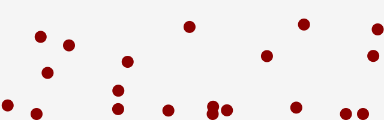
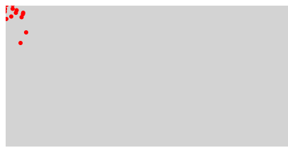

# パーティクルシステム

パーティクル・システム（particle system）はコンピュータグラフィック技術のひとつで、ある種の曖昧さを持った事物をシミュレートするために使われます。一般にパーティクル・システムを使って模写される例としては、炎、爆発、煙、流水、火花、落葉、雲、霧、雪、埃、流星、毛髪、毛皮、草地、あるいは光跡や呪文の視覚効果などが挙げられます。

段階を踏んで、一つ一つ学んでいきましょう。本章の解説は、約2時間程度で学べる内容となっています。

## 1つだけのパーティクル制御を実装


- [サンプルを再生する](https://ics-creative.github.io/tutorial-createjs/samples/particle_single.html)
- [サンプルのソースコードを確認する](../samples/particle_single.html)

パーティクルは`createjs.Shape`インスタンスとして作成します。このパーティクルに対して、速度の計算を行います。

```js
// 赤い丸を作成
var particle = new createjs.Shape();
//(省略)

// 速度情報
var vx = 0;
var vy = 0;

// 時間経過
createjs.Ticker.addEventListener("tick", handleTick);
function handleTick() {
  // 重力
  vy += 1;
  // 摩擦
  vx *= 0.95;
  vy *= 0.95;
  // 反映
  particle.x += vx;
  particle.y += vy;
  // 地面の作成
  //(省略)
}
```


## 配列で複数のパーティクルを制御



- [サンプルを再生する](https://ics-creative.github.io/tutorial-createjs/samples/particle_multi.html)
- [サンプルのソースコードを確認する](../samples/particle_multi.html)

まずは複数のパーティクルを管理する配列を作成しましょう。

```js
var particleList = [];　
```

※ `[]`と記述しても`new Array()`と記述しても同じです。多くのコーディング規約で`[]`と記述することが推奨されているので、本サイトでは配列は`[]`として作成します。


`for`文を使って、複数のパーティクルを作成し、この配列に保存します。パーティクルの発生座標は視覚的にわかりやすくするために、`Math.random()`メソッドを使ってランダムな座標にしています。

```js
// for文を作成 (上限数はパーティクルの個数)
for (var i = 0; i < 20; i++) {
 // 赤い丸を作成
 var particle = new createjs.Shape();
 //(省略)
 particle.x = stage.canvas.width * Math.random();
 particle.y = stage.canvas.height * Math.random();
 //(省略)

 // 配列に保存
 particleList[i] = particle;
}
```

速度情報の`vx`と`vy`は`createjs.Shape`インスタンスのプロパティーとして設定しています(`particle.vx = 0;`)。JavaScriptは動的言語といい、自由にオブジェクトのプロパティーを追加できます。本来は`createjs.Shape`に`vx`と`vy`プロパティーは存在しませんが、速度情報はパーティクル自身それぞれで管理するべきものなので、パーティクル自身に速度情報をもたせたほうがプログラムの見通しがよくなります。

```js
particle.vx = 0;
particle.vy = 0;
```

次に`tick`イベントでは配列に保存した複数のパーティクルを制御します。`for`文では配列の長さ`particleList.length`に応じてループさせます。配列の制御では要素を変数に取り出し(`var particle = particleList[i];`)、一個のパーティクルを制御したときと同じ処理を実装します。

```js
function handleTick() {
  for (var i = 0; i < particleList.length; i++) {
    // i番目の要素を変数に代入
    var particle = particleList[i];
    // 重力
    particle.vy += 1;
    // 摩擦
    particle.vx *= 0.95;
    particle.vy *= 0.95;
    // 反映
    particle.x += particle.vx;
    particle.y += particle.vy;

    //(省略)
  }
  //(省略)
}
```

## パーティクルを時間経過で発生させ、寿命を設ける



- [サンプルを再生する](https://ics-creative.github.io/tutorial-createjs/samples/particle_life.html)
- [サンプルのソースコードを確認する](../samples/particle_life.html)

### プログラムの構造 : `tick`イベントで2つの関数を呼び出して制御

時間経過でパーティクルを発生させたいので、パーティクルの作成を`tick`イベントで行います。`emitParticles()`関数でパーティクルを発生させ、`updateParticles()`関数でパーティクルを動かします。

```js
// 配列でパーティクルを管理します
var particles = [];

// tick イベントを登録する
createjs.Ticker.addEventListener("tick", handleTick);
function handleTick(event) {
  // パーティクルを発生
  emitParticles();
  // パーティクルを更新
  updateParticles();
  // 画面を更新する
  stage.update();
}
```

これらの関数の役割を掘り下げてみましょう。

#### パーティクルの発生を担当する`emitParticles()`関数

パーティクルは時間経過で次々と発生します。配列の大きさに制限はなく、いくらでも要素を追加することができます。今回は新しく発生したパーティクルは配列の最後に追加するため、`push()`メソッドを使ってパーティクルを保存しています。

```js
// パーティクルを発生させます
function emitParticles() {
  // パーティクルの生成
  for (var i = 0; i < 10; i++) {
    // オブジェクトの作成
    var particle = new createjs.Shape();
    stage.addChild(particle);
    //(省略)
    // 配列に保存
    particles.push(particle);
  }
}
```

パーティクルには座標`x`、`y`や速度情報`vx`、`vy`を設定しますが、今回はパーティクルに寿命`life`を設定します。`createjs.Shape`クラスには`life`というプロパティーは本来存在しませんが、勝手に追加しておきます。

```js
// 寿命
particle.life = 100;
```

#### パーティクルの更新を担当する`updateParticles()`関数

パーティクルの更新処理では寿命の更新をおこないます。寿命というと難しいように思いますが、処理としてはプロパティー`life`の値を`-1`するだけです。1回の`tick`イベントで`life`が1ずつ減っていきます。

```js
// パーティクルを更新します
function updateParticles() {
  // パーティクルの計算を行う
  for (var i = 0; i < particles.length; i++) {
    // オブジェクトの作成
    var particle = particles[i];
    // (省略)
    // 寿命を減らす
    particle.life -= 1;

    // 寿命の判定
    if (particle.life <= 0) {
      // (省略)
    }
  }
}
```

寿命がつきたとき、つまり`life`が`0`になったときにパーティクルを消去しましょう。`if`文での判定は`life`が`0`になったかどうかを調べればわかります。削除処理には２つの実装が必要となり、画面から消す`stage.removeChild()`と、保存されている配列からの消去`particles.splice()`を行います。

`removeChild()`はステージから消去する命令で画面からパーティクルを消すことができます。配列の`splice(a, b)`は配列の`a`番目から`b`個の要素を消すという命令になります。画面から消すだけでは不十分で、配列からもパーティクルを消しておかなければ、無駄に座標更新や物理演算の計算が行われ続けます。

```js
// 寿命の判定
if (particle.life <= 0) {
  // ステージから削除
  stage.removeChild(particle);

  // 配列からも削除
  particles.splice(i, 1);
}
```


## カラフルなパーティクルシステムの実装


- [サンプルを再生する](https://ics-creative.github.io/tutorial-createjs/samples/particle_colorful.html)
- [サンプルのソースコードを確認する](../samples/particle_colorful.html)

最後に表現をブラッシュしていきましょう。

### パーティクルの色を時間経過で変える

`beginFill()`メソッドでパーティクルの色を設定しますが、これを時間経過で色をかえていきます。今回は時間経過で色相(赤→緑→青)をかえるためにHSLカラーを使います。HSLカラーは[カラーの説明](shape_color.md)で説明しましたが、値(0〜360で色相環の一周になる)をかえるだけで色相が変わります。カラフルな表現をつくるときに便利な命令です。`count`変数は`tick`イベントが発生するたびにインクリメント(1ずつ増やすこと)させておきます。

```js
// オブジェクトの作成
var particle = new createjs.Shape();
particle.graphics
       .beginFill(createjs.Graphics.getHSL(count, 50, 50))
       .drawCircle(0, 0, 30 * Math.random());
stage.addChild(particle);
```

### パーティクルの合成方法を変える

表示オブジェクトの重なり方を指示できる`compositeOperation`プロパティーを使って、レイヤーの合成方法を変更させておきます。パーティクルとパーティクルが重ねると、色が加算されて(`lighter`の指定によって)、明るくみえるようになります。

```js
particle.compositeOperation = "lighter";
```

### パーティクルのサイズを時間経過で小さくする

`life`プロパティーの数値に比例して、パーティクルのサイズを小さくさせてみましょう。大きさを変化させるには`scaleX`と`scaleY`プロパティーを使います。現在のライフが寿命の何%に相当するかを計算し(`particle.life / MAX_LIFE`)、その値が`0.0〜1.0`の範囲になるので`scaleX`と`scaleY`プロパティーに適用します。

```js
var MAX_LIFE = 40; // 寿命の最大値

// パーティクルを発生させます
function emitParticles() {
  // パーティクルの生成
  for (var i = 0; i < 5; i++) {
    // (省略)
    // 寿命
    particle.life = MAX_LIFE;
  }
}

// パーティクルを更新します
function updateParticles() {
  // パーティクルの計算を行う
  for (var i = 0; i < particles.length; i++) {
    // (省略)
    // パーティクルのサイズをライフ依存にする
    var scale = particle.life / MAX_LIFE;
    particle.scaleX = particle.scaleY = scale;

    // 寿命を減らす
    particle.life -= 1;
    // (省略)
  }
}
```

## まとめ

いかがでしたでしょうか。パーティクルは難しそうなものに見えますが、一つ一つ分解してみるとシンプルな実装の組み合わせに過ぎません。パーティクルの移動方向や、パーティクル自体の形状を変更すると様々な表現に転換できます。ぜひ、いろいろパラメーターを調整してみてください。


[目次に戻る](../ReadMe.md)
