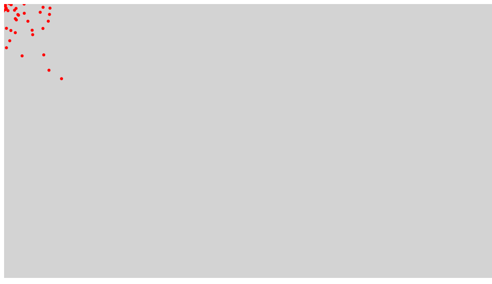

# パーティクルシステム

パーティクル・システム（英: particle system）はコンピュータグラフィック技術のひとつで、従来型のレンダリング技術では再現が難しい、ある種の曖昧さを持った事物をシミュレートするために使われる。一般にパーティクル・システムを使って模写される事物の例としては、炎、爆発、煙、流水、火花、落葉、雲、霧、雪、埃、流星、毛髪、毛皮、草地、あるいは光跡や呪文の視覚効果などが挙げられる。

- [サンプルを再生する](https://ics-creative.github.io/tutorial-createjs/samples/particle.html)
- [サンプルのソースコードを確認する](../samples/particle.html)

[目次に戻る](../ReadMe.md)
