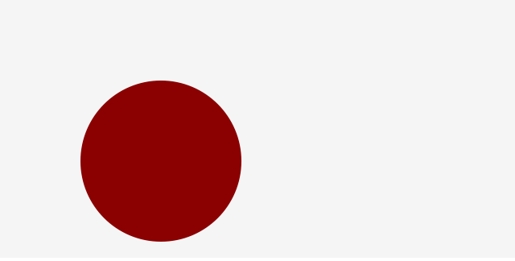

# 簡単な CreateJS のサンプルを試そう

まずは簡単なサンプルを通してCreateJSがどのようなものなのか確認しましょう。次のコードをHTMLファイルにコピー&ペーストして、ブラウザで開くと画面に赤い円が表示されます。

```html
<!DOCTYPE html>
<html>
<head>
	<meta charset="UTF-8">
	<script src="https://code.createjs.com/createjs-2015.11.26.min.js"></script>
	<script>
		window.addEventListener("load", init);
		function init() {
			// Stageオブジェクトを作成します
			var stage = new createjs.Stage("myCanvas");

			// 円を作成します
			var shape = new createjs.Shape();
			shape.graphics.beginFill("DarkRed"); // 赤色で描画するように設定
			shape.graphics.drawCircle(0, 0, 100); //半径 100px の円を描画
			shape.x = 200; // X 座標 200px の位置に配置
			shape.y = 200; // Y 座標 200px の位置に配置
			stage.addChild(shape); // 表示リストに追加

			// Stageの描画を更新します
			stage.update();
		}
	</script>
</head>

<body>
	<canvas id="myCanvas" width="960" height="540"></canvas>
</body>
</html>

```




- [サンプルを再生する](https://ics-creative.github.io/tutorial-createjs/samples/quickstart.html)
- [サンプルのソースコードを確認する](../samples/quickstart.html)


CreateJSはHTML5の`canvas`要素を利用します。`canvas`要素はコンテンツを表示する描画エリアとなります。`canvas`要素には3つの属性として`id`(ID値)と`width`(幅)と`height`(高さ)を最低限設定しておきましょう。

```html
<body>
	<canvas id="myCanvas" width="960" height="540"></canvas>
</body>
```

次にJavaScriptライブラリを読み込みます。CreateJSはJavaScriptのライブラリですが、これを読み込むことによってはじめてCreateJSが利用できるようになります。

```html
<script src="https://code.createjs.com/createjs-2015.11.26.min.js"></script>
```

具体的な処理はページの読み込みが終わってから実行させます。`addEventListener()`関数を使って`load`イベントが発生するのを監視させ、ページが読み込み終わったときに実行させたい関数を指定します。この関数`init()`の中にCreateJSのコードを書いていきます。

```html
<script>
window.addEventListener("load", init);
function init(){
	// 処理
}
</script>
```

ここからは関数`init()`の中にコードを書いていきます。まずは`createjs.Stage`クラスを使ってステージを作成します。`createjs.Stage`クラスの引数にはcanvas要素の`id`値に指定します。`stage`変数とは舞台と考えておくといいでしょう。

```js
// Stageオブジェクトを作成。表示リストのルートになります。
var stage = new createjs.Stage("myCanvas");
```

※`createjs.Stage`クラスの詳しい使い方は「 [公式ドキュメント(日本語訳)](http://createjs.sub.jp/ja/EaselJS/reference/classes/Stage.html)」を確認ください。

`createjs.Shape`クラスを使って円のシェイプ(図形)を作成します。

※`createjs.Shape`クラスの機能は後述で詳しく説明します。現時点ではグラフィックの描き方を理解する必要はありません。

```js
// 円を作成します
var shape = new createjs.Shape();
shape.graphics.beginFill("DarkRed"); // 赤色で描画するように設定
shape.graphics.drawCircle(0, 0, 100); //半径100pxの円を描画
```

シェイプ(図形)を作成したものの、上記のコードではプログラムの中で作成したに過ぎないので、ステージに登場させ見えるようにする必要があります。`addChild()`という命令はステージに登場させるために必要な命令です。

```js
stage.addChild(shape); // 表示リストに追加
```

最後にCreateJSで処理した結果をcanvas要素に反映させます。`stage.update()`関数を使って反映させましょう。

```js
// Stageの描画を更新
stage.update();
```

※`update()`メソッドの詳しい使い方は「 [公式ドキュメント(日本語訳)](http://createjs.sub.jp/ja/EaselJS/reference/classes/Stage.html#method_update)」を確認ください。

これがCreateJSの簡単なサンプルです。具体的に一つずつ順番に理解していきましょう。

[次の記事へ](debug.md)
