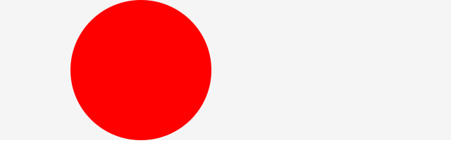
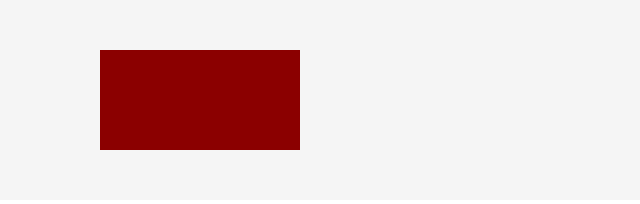
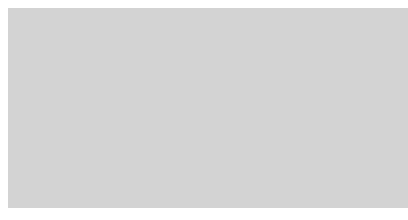
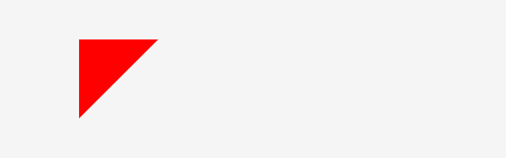

# CreateJS での様々な図形の描画方法

## 円を描く

丸い正円を描いてみましょう。コード量も少なく一番簡単に描ける図形です。

書式
```js
Graphicsオブジェクト.drawCircle(中心のX座標, 中心のY座標, 半径);
```

サンプル
```js
var shape = new Shape();
shape.graphics.beginFill("DarkRed"); // 赤色で描画するように設定
shape.graphics.drawCircle(0, 0, 100); //半径100pxの円を描画
stage.addChild(shape); // 表示リストに追加
```




- [サンプルを再生する](https://ics-creative.github.io/tutorial-createjs/samples/shape_circle.html)
- [サンプルのソースコードを確認する](../samples/shape_circle.html)


※詳しい使い方は「[公式ドキュメント(英語)](https://createjs.com/docs/easeljs/classes/Graphics.html#method_drawCircle)」を確認ください。


## 四角形を描く

四角形を描いてみましょう。

書式
```js
Graphicsオブジェクト.drawRect(X座標, Y座標, 横幅, 高さ);
```

サンプル
```js
// 四角形を作成します
var shape = new createjs.Shape();
shape.graphics.beginFill("DarkRed"); // 赤色で描画するように設定
shape.graphics.drawRect(0, 0, 200, 100); // 長方形を描画
stage.addChild(shape); // 表示リストに追加
```



- [サンプルを再生する](https://ics-creative.github.io/tutorial-createjs/samples/shape_rect.html)
- [サンプルのソースコードを確認する](../samples/shape_rect.html)

※詳しい使い方は「[公式ドキュメント(英語)](https://createjs.com/docs/easeljs/classes/Graphics.html#method_drawRect)」を確認ください。

## 角丸四角形を描く

4隅を丸くした四角形を角丸四角形と言います。角丸四角形を描いてみましょう。

書式
```js
Graphicsオブジェクト.drawRect(X座標, Y座標, 横幅, 高さ, 角丸の幅, 角丸の高さ);
```

サンプル
```js
// 角丸四角形を作成します
var shape = new createjs.Shape();
shape.graphics.beginFill("DarkRed"); // 赤色で描画するように設定
shape.graphics.drawRoundRect(0, 0, 100, 100, 20, 20); //100pxの正方形を描画。20pxの角丸を設定。
stage.addChild(shape); // 表示リストに追加
```




- [サンプルを再生する](https://ics-creative.github.io/tutorial-createjs/samples/shape_roundrect.html)
- [サンプルのソースコードを確認する](../samples/shape_roundrect.html)


※詳しい使い方は「[公式ドキュメント(英語)](https://createjs.com/docs/easeljs/classes/Graphics.html#method_drawRoundRect)」を確認ください。


## 多角形の描画

`drawPolyStar()`メソッドを使うことで多角形を描くことができます。第1～3引数は`drawCircle()`メソッドと同じですが、第4引数が頂点の数です。第5引数の谷の深さは谷の深さで、`0`以上`1`未満の数値を設定します。デフォルト値の0を渡すと谷はなくなり、正多角形になります。第6引数は頂点の角度で、デフォルト値`0`ではx軸の正方向つまり時計の3時の方向を起点に描かれます。y軸の負つまり時計の12時の方向から描くには、`-90`度を起点の角度とします。

書式
```js
Graphicsオブジェクト.drawPolyStar(x座標, y座標, 半径, 頂点数, 谷の深さ, 起点角)
```

サンプル
```js
var poly = new createjs.Shape();
poly.graphics.beginFill("DarkRed"); // 赤色で描画するように設定
poly.graphics.drawPolyStar(0, 0, 75, 5, 0.6, -90); //75pxの星を記述
stage.addChild(poly); // 表示リストに追加
```


- [サンプルを再生する](https://ics-creative.github.io/tutorial-createjs/samples/shape_polystar.html)
- [サンプルのソースコードを確認する](../samples/shape_polystar.html)

※詳しい使い方は「[公式ドキュメント(英語)](https://createjs.com/docs/easeljs/classes/Graphics.html#method_drawPolyStar)」を確認ください。


## 任意の図形の描画

`moveTo()`メソッドと`lineTo()`メソッドを使うことで、自由に頂点を設定して描くことができます。`moveTo()`メソッドで現在の描画位置を移動し、`lineTo()`メソッドで現在の描画位置から次の描画位置まで、現在の線のスタイルを使用して線を描画します。

書式
```js
Graphicsオブジェクト.moveTo(x座標, y座標);
Graphicsオブジェクト.lineTo(x座標, y座標);
```

サンプル
```js
var obj = new createjs.Shape();
obj.graphics.beginFill("DarkRed"); // 赤色で描画するように設定
obj.graphics.moveTo(0, 0); // (0,0)座標から描き始める
obj.graphics.lineTo(100, 0); // (100,0)座標まで辺を描く
obj.graphics.lineTo(0, 100); // (0,100)座標まで辺を描く
obj.graphics.lineTo(0, 0); // (0,0)座標まで辺を描く
stage.addChild(obj); // 表示リストに追加
```




- [サンプルを再生する](https://ics-creative.github.io/tutorial-createjs/samples/shape_other.html)
- [サンプルのソースコードを確認する](../samples/shape_other.html)


※詳しい使い方は「[公式ドキュメント(英語)](https://createjs.com/docs/easeljs/classes/Graphics.html#method_lineTo)」を確認ください。


## コラム : ドットシンタックス

また CreateJS の特徴として、ドット`.`をつなげて記述するチェーンメソッドで記述することも可能です。チェーンメソッドで記述するかしないかはプログラマーの好みですので、好きな方で記述ください。

```js
var shape = new createjs.Shape();
shape.graphics.beginFill("#00ff00") // 緑色で描画するように設定
	.setStrokeStyle(4) // 4pxの線幅を設定
	.beginStroke("#0000ff") // 青色の線を描画するように設定
	.drawCircle(0, 0, 100); //半径100pxの円を描画
stage.addChild(shape); // 表示リストに追加
```

※`createjs.Shape`クラスは、WebGLを活用する`StageGL`クラスでは「[公式ドキュメント(英語)](https://createjs.com/docs/easeljs/classes/StageGL.html)」に記載のとおり、レンダリングされないので注意ください。


[次の記事へ](text.md)


<article-author>[池田 泰延](https://twitter.com/clockmaker)</article-author>
<article-date-published>2015-11-29</article-date-published>
<article-date-modified>2019-01-10</article-date-modified>
