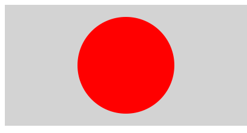
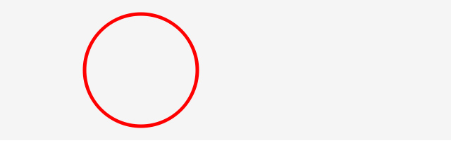

シェイプには塗りと枠線を設定できます。塗りだけを設定したり、線だけを描いて塗らないということも可能です。

## 塗り

塗りというのは図形に囲まれた領域となります。`beginFill()`メソッドで塗りの色を指定します。

書式
```js
Graphicsオブジェクト.beginFill(塗りの色);
Graphicsオブジェクト.endFill();
```

サンプル

```js
// シェイプを作成
var shape = new createjs.Shape();
// 塗りの色を指定
shape.graphics.beginFill("DarkRed");
// 円を描く
shape.graphics.drawCircle(0, 0, 80);
```



- [サンプルを再生する](https://ics-creative.github.io/tutorial-createjs/samples/shape_begin_fill.html)
- [サンプルのソースコードを確認する](../samples/shape_begin_fill.html)


※詳しい使い方は「[公式ドキュメント(英語)](https://createjs.com/docs/easeljs/classes/Graphics.html#method_beginFill)」を確認ください。


### コラム

図形を描いたら`endFill()`メソッドで描き終わったことを指定します。必ずしも使わなくても大丈夫ですが、複数のシェイプを描くときには指定しておくほうが無難でしょう。


## 線

線とは図形の境界線のことです。`setStrokeStyle()`メソッドで線の太さを、`beginStroke()`メソッドで線の色を設定することができます。


書式

```js
Graphicsオブジェクト.beginFill(塗りの色);
Graphicsオブジェクト.setStrokeStyle(線の太さ);
```

サンプル

```js
// シェイプを作成
var shape = new createjs.Shape();
// 線の色を指定
shape.graphics.beginStroke("DarkRed");
// 線の幅を指定
shape.graphics.setStrokeStyle(5);
// 円を描く
shape.graphics.drawCircle(0, 0, 80);
```




- [サンプルを再生する](https://ics-creative.github.io/tutorial-createjs/samples/shape_begin_stroke.html)
- [サンプルのソースコードを確認する](../samples/shape_begin_stroke.html)

※詳しい使い方は「 公式ドキュメント(英語)」の[beginStroke()](https://createjs.com/docs/easeljs/classes/Graphics.html#method_beginStroke)と[setStrokeStyle()](https://createjs.com/docs/easeljs/classes/Graphics.html#method_setStrokeStyle)を確認ください。


### コラム

図形を描いたら`endStroke()`メソッドで描き終わったことを指定します。必ずしも使わなくても大丈夫ですが、複数のシェイプを描くときには指定しておくほうが無難でしょう。


[次の記事へ](shape_color.md)

