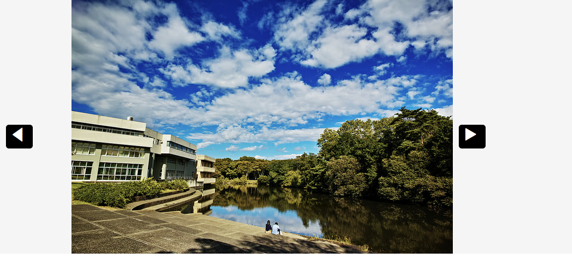
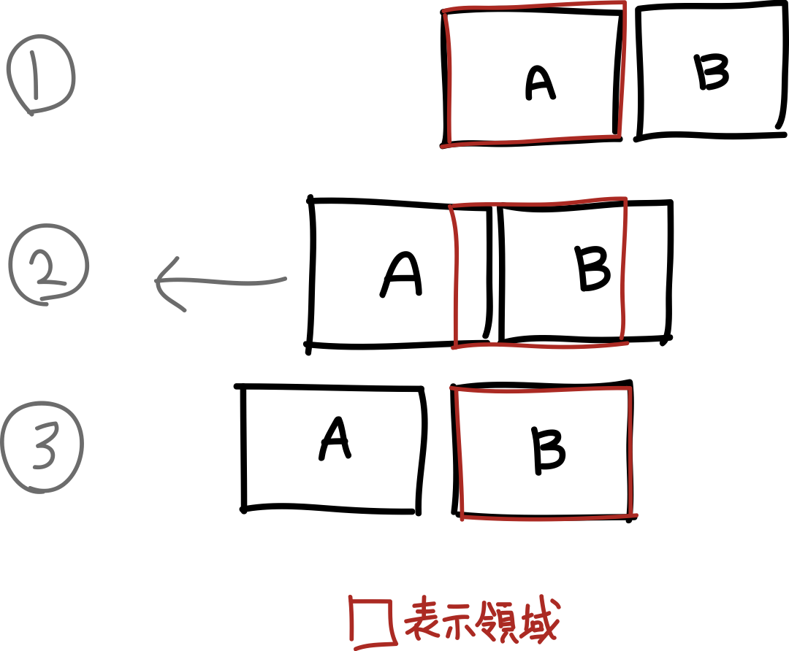

# CreateJS でカルーセルを作ろう

カルーセルとはカルーセル[carousel]とは、メリーゴーランドや空港の回転コンベアーなど、くるくると回るものを指し、WEBデザインにおいては、横に自動でスクロールするスライドギャラリーの様なもののことを指します。このカルーセルを作ってみましょう。



- [サンプルを再生する](https://ics-creative.github.io/tutorial-createjs/samples/slideshow.html)
- [サンプルのソースコードを確認する](../samples/slideshow.html)

## カルーセルの実装方針

カルーセルの演出として、水平方向にイメージがスライドするようなエフェクトを作りましょう。これの実装方法は複数のイメージを移動させたい方向にイメージを並べることです（横に移動したい場合は水平方向に）。




## マスクの適用

例えば横並びだとして考えてみましょう。横並びに配置しただけでは複数のイメージが見えてしまうので、親となる`container`インスタンスにマスク(`mask`プロパティー)を適用することで表示領域を限定しておきます。

```js
// マスク用のシェイプを作成する
var shapeMask = new createjs.Shape();
shapeMask.graphics
        .beginFill("gold") // 適当な色で塗る
        .drawRect(0, 0, PHOTO_WIDTH, 427); // 写真のサイズに設定
// マスクを適用する
container.mask = shapeMask;
```

この部分のコードをコメントアウトしてどのように切り替わるか確認するといいでしょう。

## スライドさせるには X 座標を動かす

この場合は`container`インスタンスに対してトゥイーンを適用します。`container`インスタンスは3つのイメージが水平方向に並んで配置されていますので、X座標を移動させることでスライドが移動しているような視覚効果が得られます。`x`座標の値で横に移動させるように指定しています。

```js
// ページ番号にあった配置にする
function updatePage() {
  // 目標座標を計算
  var targetX = -1 * PHOTO_WIDTH * pageNumber;
  // トゥイーンさせる
  createjs.Tween.get(container, {override: true})
          .to({x: targetX}, 2000, createjs.Ease.cubicInOut);
}
```

`{override: true}`のコードは、ボタンが連打されたときにアニメーションを正しく動作させるための指定です。トゥイーンアニメーションの再生中に、新しいトゥイーンの命令が入ったとき、再生中のトゥイーンアニメーションを中断させる効果があります。


<article-author>[池田 泰延](https://twitter.com/clockmaker)</article-author>
<article-date-published>2015-12-17</article-date-published>
<article-date-modified>2015-12-17</article-date-modified>
