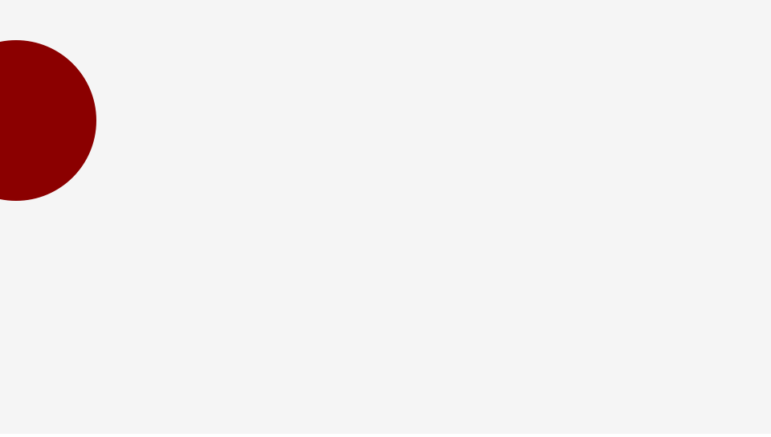

# CreateJS の Ticker の使い方

CreateJSにはインタラクティブコンテンツを実装するためのアニメーション機構を備えています。`createjs.Ticker`クラスが**アニメーション**に必要な時間経過を管理する機能となります。

## tick イベントを使おう

`createjs.Ticker`クラスの`addEventListener()`メソッドで`tick`イベントを監視することによって関数を一定間隔で実行することができます。デフォルトでは1秒間に24回の頻度で`tick`イベントが発生します。この頻度は1秒間に24フレーム存在するということで24FPS(Frame Per Secound)と一般的に呼ばれます。

```js
createjs.Ticker.addEventListener("tick", handleTick);

function handleTick(){
    console.log( new Date() );
}
```

ブラウザのコンソールパネルを開くと、時間経過によって現在時刻が次々と表示されているはずです。この`tick`イベントがアニメーション実装の基本になります。

※`createjs.Ticker`クラスの詳しい使い方は「[公式ドキュメント(英語)](http://createjs.com/docs/easeljs/classes/Ticker.html)」を確認ください。

## tick イベントでステージの更新を行う

`tick()`関数内では、`stage.update()`メソッドを呼び出し、常にステージの画面更新が呼ばれるようにしておきましょう。`stage.update()`メソッドを呼び出さなければ、画面が更新されないためです。

```js
createjs.Ticker.addEventListener("tick", handleTick);

function handleTick(){
    // 自分で実装したい処理
    stage.update();
}
```

例えば、`tick()`関数の中で動きを付けたい場合は次のように記述します。

サンプル

```js
var stage = new createjs.Stage("myCanvas");

// 円を作成します
var shape = new createjs.Shape();
shape.graphics.beginFill("DarkRed").drawCircle(0, 0, 100); //半径100pxの円を描画
shape.y = 150; // Y座標300の位置に配置
stage.addChild(shape); // 表示リストに追加

// tick イベントを監視します
createjs.Ticker.addEventListener("tick", handleTick);
function handleTick(){
	// アニメーション
	shape.x += 2;

	// Stageの描画を更新します
	stage.update();
}
```



- [サンプルを再生する](https://ics-creative.github.io/tutorial-createjs/samples/ticker.html)
- [サンプルのソースコードを確認する](../samples/ticker.html)

## Ticker のインターバルを変更する

デフォルトでは1秒間に24回発生する`tick`イベントですが、この頻度は`setFPS()`メソッドを使うことで変更できます。例えば、一秒間に60回発生させたければ次のように指定しましょう。

```js
createjs.Ticker.setFPS(60);
```

FPSには利用する表示デバイスによって異なります。例えば映画だと24FPS、日本のテレビだと30FPS(正確には29.97i)、ウェブのバナー広告だと18PFSというのが一般的です。

近年のWebコンテンツのアニメーションは60FPSでつくられることが一般的になってきました。滑らかにアニメーションを表示することが、体感的に心地よく、高い品質の体験を提供できるからです。

## 最も滑らかに表示する方法

もし60FPSを設定するのであれば、もう一つ便利な設定方法があります。実はブラウザは画面更新するのに適したタイミングをもっています。このタイミングを使えば、最もアニメーションを滑らかに表示することができます。これを`RequstAnimationFrame`と呼ぶのですが、一般的に頭文字で略して`RAF`と呼ばれます。CreateJSでこの`RAF`を使うように指定できます。

```js
createjs.Ticker.timingMode = createjs.Ticker.RAF;
```

この`RAF`というタイミングは一秒間に60回発生します。つまり、実は60FPSとほぼ同じになります。ただし、`setFPS()`メソッドで60FPSを指定するよりも確実に画面更新に適したタイミングを得ることができます。このサイトのサンプルでも可能な限り、`RAF`の指定を行っています。

## コラム : createjs.Stage の自動更新

`createjs.Ticker`の`addEventListener()`メソッドの二番目の引数に`stage`オブジェクトを与えると、update()メソッドを呼びださなくても`stage`は常に描画更新されるようになります。

```js
createjs.Ticker.addEventListener("tick", stage);
```


サンプル

```js
var stage = new createjs.Stage("myCanvas");

// 円を作成します
var shape = new createjs.Shape();
shape.graphics.beginFill("DarkRed").drawCircle(0, 0, 100); //半径100pxの円を描画
shape.y = 150; // Y座標300の位置に配置
stage.addChild(shape); // 表示リストに追加

// 自動的に画面更新させます。
createjs.Ticker.addEventListener("tick", stage);

// tick イベントを監視します
createjs.Ticker.addEventListener("tick", handleTick);
function handleTick(){
	// アニメーション
	shape.x += 2;
}
```


- [サンプルを再生する](https://ics-creative.github.io/tutorial-createjs/samples/ticker_autoupdate.html)
- [サンプルのソースコードを確認する](../samples/ticker_autoupdate.html)
