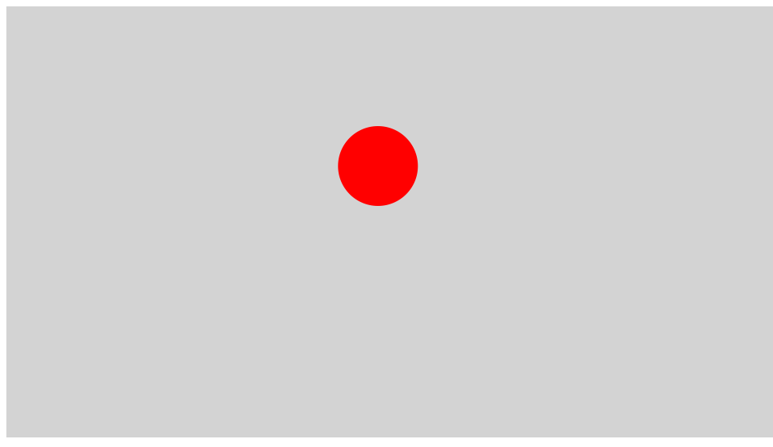
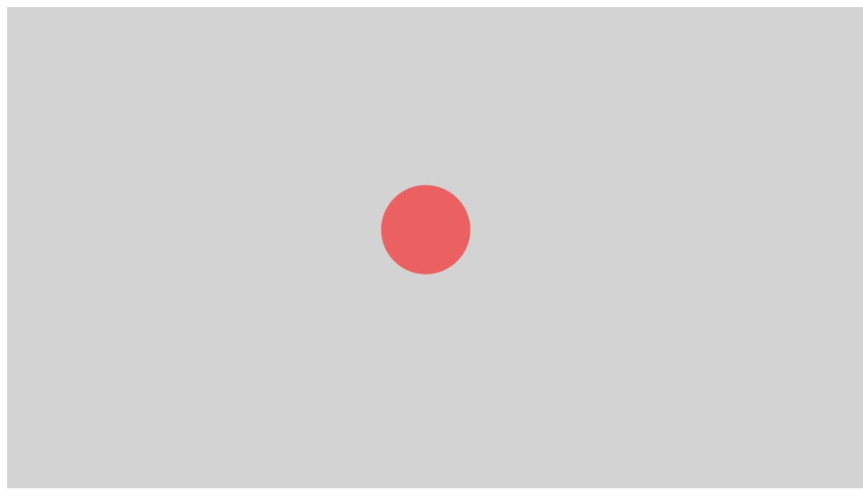
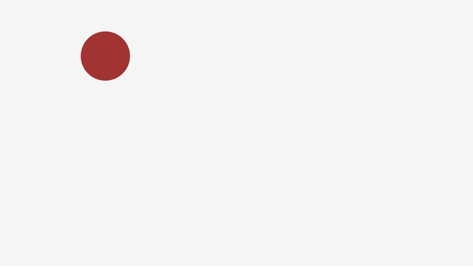
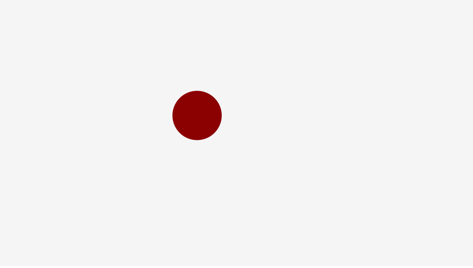

# CreateJS でのトゥイーンの作成方法

トゥイーンとは、始点と終点を設定してアニメーションさせるテクニックです。「間」を示すBetweenという単語から作られていれた用語です。CreateJSでは次の記述でトゥイーンを実装します。

```js
createjs.Tween.get(対象)
     .to(パラメーター, ミリ秒);
```

※`createjs.Tween`クラスの詳しい使い方は「[公式ドキュメント(英語)](http://createjs.sub.jp/ja/TweenJS/reference/classes/Tween.html)」を確認ください。
※トゥイーン機能を提供するJSライブラリはCreateJSに含まれる「TweenJS」となります。

## モーションを設定する

具体的な例を見て理解を深めて行きましょう。2000ミリ秒かけて円がx座標が0から940pxまで移動します。

```js
// 円のシェイプを作成
var circle = new createjs.Shape();
circle.graphics.beginFill("DarkRed").drawCircle(0, 0, 50);
circle.y = 200;
stage.addChild(circle);

createjs.Tween.get(circle) // ターゲットを指定
		.to({x: 940}, 2000);
```




- [サンプルを再生する](https://ics-creative.github.io/tutorial-createjs/samples/tween_basic.html)
- [サンプルのソースコードを確認する](../samples/tween_basic.html)

※`to()`メソッドの詳しい使い方は「[公式ドキュメント(英語)](http://createjs.sub.jp/ja/TweenJS/reference/classes/Tween.html#method_to)」を確認ください。


## 複数のモーションを設定する

`to()`メソッドには複数のパラメーターを設定し、同時にモーションさせることもできます。次のコードは、`x`座標にくわえて`y`座標と透明度の`alpha`を変化させています。

```js
// 円のシェイプを作成
var circle = new createjs.Shape();
circle.graphics.beginFill("DarkRed").drawCircle(0, 0, 50);
circle.x = 0;
circle.y = 0;
stage.addChild(circle);

createjs.Tween.get(circle) // ターゲットを指定
		.to({x: 940, y:500, alpha:0.1}, 2000);
```



- [サンプルを再生する](https://ics-creative.github.io/tutorial-createjs/samples/tween_multi.html)
- [サンプルのソースコードを確認する](../samples/tween_multi.html)


## 連続のモーションを設定する

TweenJSはメソッドチェーンと呼ばれる書き方で、複数のモーションを設定することができます。`.`と`;`の記述する場所に気をつけましょう。

```js
// 円のシェイプを作成
var circle = new createjs.Shape();
circle.graphics.beginFill("DarkRed").drawCircle(0, 0, 50);
stage.addChild(circle);

createjs.Tween.get(circle) // ターゲットを指定
		// 画面右下へ移動
		.to({x: 940, y: 500, alpha: 0.1}, 2000)
		// 画面中央上へ移動
		.to({x: 500, y: 0, alpha: 1.0}, 3000)
		// 画面中央へ移動
		.to({x: 500, y: 300}, 3000)
		// 300%の大きさに変形
		.to({scaleX: 3, scaleY: 3}, 5000);
```



- [サンプルを再生する](https://ics-creative.github.io/tutorial-createjs/samples/tween_chain.html)
- [サンプルのソースコードを確認する](../samples/tween_chain.html)


## モーションに緩急を設定する

モーションに緩急をつけることで表現のバリエーションを増やし、「心地よさ」や「わかりやすさ」を高めることができます。モーションの緩急は「イージング」という用語として呼ばれます。CreateJSでは、`to()`メソッドの三番目の引数にイージングの種類を設定します。

書式

```js
createjs.Tween.get(対象)
     .to(パラメーター, ミリ秒, イージングの種類);
```

イージングの種類は主に以下があります。

- `ease.Ease.cubicIn` 始まりがゆっくりで、加速していく
- `ease.Ease.cubicOut` 始まりが最高速で、減速していく
- `ease.Ease.cubicInOut` 始まりがゆっくりで加速し、最後は減速する
- `ease.Ease.bounceOut` ボールが跳ね返るような動き
- `ease.Ease.backOut` 目標を行き過ぎてから戻ってくる動き

他にもイージングの種類が存在しますが、[TweenJSのサンプル](http://createjs.com/demos/tweenjs/tween_sparktable)を試すと違いがわかりやすいでしょう。

※`createjs.Ease`クラスの詳しい使い方は「[公式ドキュメント(英語)](http://createjs.com/docs/tweenjs/classes/Ease.html)」を確認ください。

サンプル

```js
// 円のシェイプを作成
var circle = new createjs.Shape();
circle.graphics.beginFill("DarkRed").drawCircle(0, 0, 50);
circle.x = 400;
circle.y = 0;
stage.addChild(circle);

createjs.Tween.get(circle) // ターゲットを指定
		.to({y: 490}, 2000, createjs.Ease.bounceOut);
```



- [サンプルを再生する](https://ics-creative.github.io/tutorial-createjs/samples/tween_ease.html)
- [サンプルのソースコードを確認する](../samples/tween_ease.html)

[次の記事へ](tween_api.md)


<article-author>[池田 泰延](https://twitter.com/clockmaker)</article-author>
<article-date-published>2015-11-22</article-date-published>
<article-date-modified>2018-02-20</article-date-modified>
